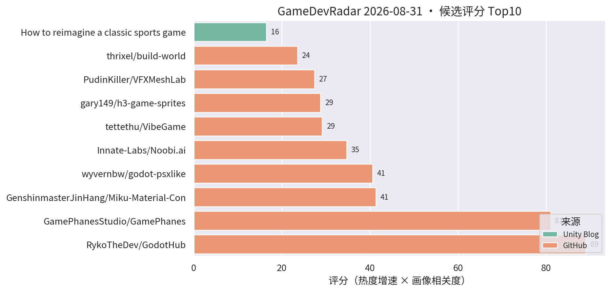
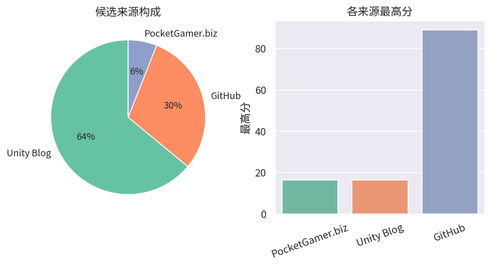

# 游戏开发技术雷达 · 2026-08-31（LLM 点评版）

> 自动生成于 2026-08-31 17:27 (UTC+8)（新画像重跑版）。评分 = 热度增速 × 个人画像相关度，点评由 LLM 按画像软判断。仅供每日速览, 上榜与否不是质量背书。

**今日看点**

1. 画像升级首战告捷：新增 trainer/god mode/aimbot 等 block 词后，连续两天霸榜的外挂垃圾仓已从源头消失；新增 GameDeveloper / GamesIndustry.biz / PocketGamer.biz / 80.lv 四个行业源。
2. 新源当天见效：PocketGamer.biz 贡献 Roblox 分析/LiveOps 工具新闻上榜——手游运营工具链的行业动态以后会更常见。
3. 榜单头部不变：GodotHub 890★ 与 GamePhanes 540★ 领跑，Miku（155★）、VFXMeshLab（96★）、h3-game-sprites（107★）持续增值。

| # | 评分 | 项目 / 话题 | 来源 | 信号 | 简介 | 点评 |
|---|---|---|---|---|---|---|
| 1 | 89.0 | [RykoTheDev/GodotHub](https://github.com/RykoTheDev/GodotHub) | github | 890★ / 40天 | What if Unity Hub and GitHub Desktop had a Baby but its Adop | Godot 版「Unity Hub + GitHub Desktop」项目管理器；趋势级信号，看个方向即可。 |
| 2 | 81.0 | [GamePhanesStudio/GamePhanes](https://github.com/GamePhanesStudio/GamePhanes) | github | 540★ / 10天 | An open-source game coding agent environment and benchmark f | Godot 游戏编码 Agent 的开源环境 + 基准测试；「AI 写游戏」评测化趋势确立，趋势级必看。 |
| 3 | 41.36 | [GenshinmasterJinHang/Miku-Material-Converter-Blender-to-Unity-](https://github.com/GenshinmasterJinHang/Miku-Material-Converter-Blender-to-Unity-) | github | 155★ / 30天 | Miku is an open-source material conversion pipeline that tra | Blender 5.2 Shader Nodes → Unity 6 URP Shader Graph 的开源转换管线，材质语义不丢；做 URP 的 TA/美术管线强烈建议花 5 分钟。 |
| 4 | 34.71 | [Innate-Labs/Noobi.ai](https://github.com/Innate-Labs/Noobi.ai) | github | 243★ / 21天 | Local-first desktop agent that turns a prompt into a reviewe | 本地优先桌面 Agent：prompt → 带 review 的可玩网页游戏（Codex App Server）；人审环节让它比玩具型生成器更工程化。 |
| 5 | 29.16 | [tettethu/VibeGame](https://github.com/tettethu/VibeGame) | github | 150★ / 18天 | VibeGame: Vibe Your Dream Game -- An open-source self-evolvi | 自然语言生成可玩 2D 网页游戏的自进化多 Agent 框架；看趋势不看实用。 |
| 6 | 28.8 | [gary149/h3-game-sprites](https://github.com/gary149/h3-game-sprites) | github | 107★ / 13天 | Agent Skill: turn AI-generated video into 2D game sprite she | AI 视频转 2D 序列帧 sprite sheet 的 Agent Skill，稳定百星；做 2D/卡牌表现的值得先跑通一次流程。 |
| 7 | 27.4 | [PudinKiller/VFXMeshLab](https://github.com/PudinKiller/VFXMeshLab) | github | 96★ / 35天 | Unity 6 URP editor tool for procedural VFX mesh authoring, m | URP 程序化 VFX 网格工具，96★ 持续加速；做技能/卡牌特效的值得 clone 试。 |
| 8 | 23.56 | [thrixel/build-world](https://github.com/thrixel/build-world) | github | 67★ / 27天 | Build interactive 3D worlds with high-quality assets from Th | 文本/Agent 驱动搭建可交互 3D 世界；原型演示向，看趋势即可。 |
| 9 | 16.5 | [How to reimagine a classic sports game for a new generation with level design, worldbuilding, and VFX](https://unity.com/blog/reimagining-backyard-baseball-3d-level-design-and-environment-art) | Unity Blog | 官方发布 | Learn how Mega Cat Studios used Unity, readable level design | Mega Cat 用 Unity 把 Backyard Baseball 重制成 3D：可读性关卡设计 + 贴花 + 光照 + VFX；美术向案例，闲时翻。 |
| 10 | 16.5 | [Building Westeros for mobile in Game of Thrones: Dragonfire](https://unity.com/blog/building-westeros-for-mobile-in-game-of-thrones-dragonfire) | Unity Blog | 官方发布 | Explore how Warner Bros. Games Boston optimized Game of Thro | WB Boston 手游化权游 IP：多人扩展、加载提速、Unity 工具链优化；一线商业手游性能优化的对口案例，值得 5 分钟。 |
| 11 | 16.5 | [Roblox launches new analytics and experimentation tools](https://www.pocketgamer.biz/roblox-launches-new-analytics-and-experimentation-tools/) | PocketGamer.biz | 官方发布 | Roblox&rsquo;s analytics and LiveOps platforms are enabling  | Roblox 上线新的分析 + 实验工具平台；做手游数据/LiveOps 的可以看看头部平台在卷什么能力，新行业源的首个上榜条目。 |
| 12 | 15.0 | [How Oxobox Games built a data-driven board to power Sente’s six-player strategy](https://unity.com/blog/data-driven-board-six-player-strategy-sente) | Unity Blog | 官方发布 | How Oxobox Games used Unity's Timeline and a data-driven boa | 用 Timeline + 数据驱动棋盘做六人同步回合策略；做卡牌/战棋的可以直接参考其棋盘数据结构设计。 |
| 13 | 15.0 | [Adapting Causa: Into the Dusk for mobile with Unity 6.3](https://unity.com/blog/adapting-causa-into-the-dusk-for-mobile) | Unity Blog | 官方发布 | In this video, the Niebla Games team explains how they worke | PC 游戏用 Unity 6.3 移植手游并上 Google Play Pass 的访谈；关注 6.3 移动端实际表现的可看，视频形式信息密度一般。 |
| 14 | 15.0 | [How Playrix is growing Township with Unity Ads’ D28 IAP ROAS optimizer](https://unity.com/blog/playrix-township-roas-optimization-vector) | Unity Blog | 官方发布 | Discover how Playrix scaled user acquisition for Township us | Playrix 用 D28 IAP ROAS 优化买量的案例；商业手游团队看长线回收模型可参考。 |

---
*由 GameDevRadar 生成（LLM 点评层）· 画像配置见 profile.json · 觉得哪类多了/少了就改画像, 别忍着*
