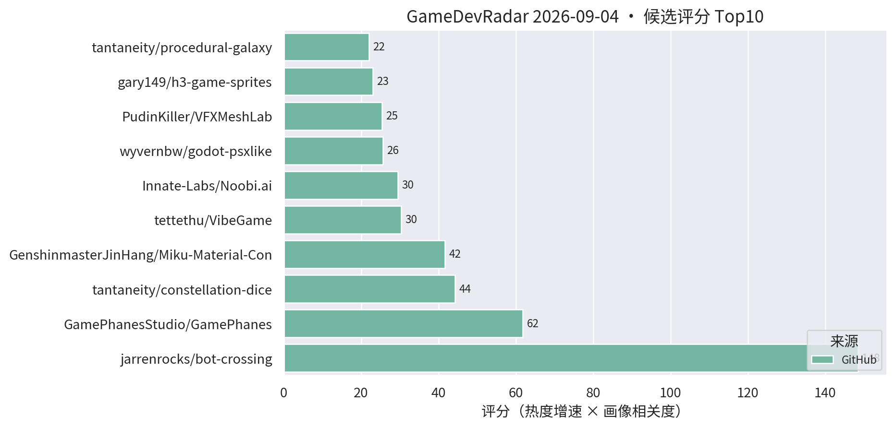
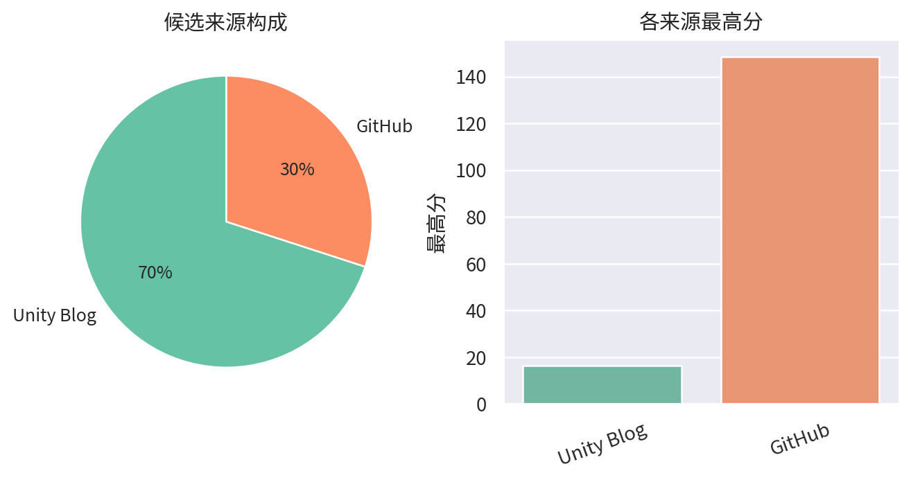

# 游戏开发技术雷达 · 2026-09-04（LLM 点评版）

> 自动生成于 2026-09-04 10:24 (UTC+8)。评分 = 热度增速 × 个人画像相关度，点评由 LLM 按画像软判断。仅供每日速览, 上榜与否不是质量背书。

**今日看点**

1. bot-crossing 一天从 14★ 爆到 99★ 登顶：「给 AI Agent 玩的游戏」这个方向被验证了，agent-native 游戏从边缘实验变成热门话题。
2. tantaneity 梅开二度：继星空骰子后又发 URP 单 pass 体积 raymarch 螺旋银河，个人 shader 作者连续产出高质量玩具，值得关注其人。
3. VFXMeshLab 卡在 99★，Miku 177★ 稳步上行——URP 工具链整体热度不减。

| # | 评分 | 项目 / 话题 | 来源 | 信号 | 简介 | 点评 |
|---|---|---|---|---|---|---|
| 1 | 148.5 | [jarrenrocks/bot-crossing](https://github.com/jarrenrocks/bot-crossing) | github | 99★ / 2天 | A video game for AI agents. | 「给 AI Agent 玩的游戏」一天 99★ 登顶，增速全场最快；agent-native 游戏设计（玩家即 Agent）是值得标记的新品类，建议点开看它怎么定义交互。 |
| 2 | 61.84 | [GamePhanesStudio/GamePhanes](https://github.com/GamePhanesStudio/GamePhanes) | github | 536★ / 13天 | An open-source game coding agent environment and benchmark f | Godot 游戏编码 Agent 的开源环境 + 基准测试；「AI 写游戏」评测化趋势确立，趋势级必看。 |
| 3 | 44.31 | [tantaneity/constellation-dice](https://github.com/tantaneity/constellation-dice) | github | 19★ / 3天 | Astral dice in Unity URP: nebula, stars and per-face constel | URP 单 pass raymarching 星空骰子 shader（HLSL/SDF/体积渲染）；学 shader 的值得拆开看，技术密度很高。 |
| 4 | 41.68 | [GenshinmasterJinHang/Miku-Material-Converter-Blender-to-Unity-](https://github.com/GenshinmasterJinHang/Miku-Material-Converter-Blender-to-Unity-) | github | 177★ / 34天 | Miku is an open-source material conversion pipeline that tra | Blender 5.2 Shader Nodes → Unity 6 URP Shader Graph 的开源转换管线；做 URP 的 TA/美术管线强烈建议花 5 分钟。 |
| 5 | 30.38 | [tettethu/VibeGame](https://github.com/tettethu/VibeGame) | github | 191★ / 22天 | VibeGame: Vibe Your Dream Game -- An open-source self-evolvi | 自然语言生成可玩 2D 网页游戏的自进化多 Agent 框架；看趋势不看实用。 |
| 6 | 29.52 | [Innate-Labs/Noobi.ai](https://github.com/Innate-Labs/Noobi.ai) | github | 246★ / 25天 | Local-first desktop agent that turns a prompt into a reviewe | 本地优先桌面 Agent：prompt → 带 review 的可玩网页游戏；人审环节让它比玩具型生成器更工程化。 |
| 7 | 25.4 | [PudinKiller/VFXMeshLab](https://github.com/PudinKiller/VFXMeshLab) | github | 99★ / 39天 | Unity 6 URP editor tool for procedural VFX mesh authoring, m | URP 程序化 VFX 网格工具，卡在 99★；做技能/卡牌特效的值得 clone 试。 |
| 8 | 23.06 | [gary149/h3-game-sprites](https://github.com/gary149/h3-game-sprites) | github | 112★ / 17天 | Agent Skill: turn AI-generated video into 2D game sprite she | AI 视频转 2D 序列帧 sprite sheet 的 Agent Skill；做 2D/卡牌表现的值得先跑通一次流程。 |
| 9 | 22.0 | [tantaneity/procedural-galaxy](https://github.com/tantaneity/procedural-galaxy) | github | 2★ / 1天 | Raymarched procedural spiral galaxy in Unity URP. Single vol | 星空骰子作者新作：URP 单体积 pass raymarch 螺旋银河；信号尚弱（2★），但和昨日榜首同一技术路线，shader 玩家可关注作者后续。 |
| 10 | 21.75 | [thrixel/build-world](https://github.com/thrixel/build-world) | github | 71★ / 31天 | Build interactive 3D worlds with high-quality assets from Th | 文本/Agent 驱动搭建可交互 3D 世界；原型演示向，看趋势即可。 |
| 11 | 19.91 | [nuskey8/SpriteAfterimage](https://github.com/nuskey8/SpriteAfterimage) | github | 29★ / 8天 | High-performance afterimage effect for Unity 2D using GPU in | Unity 2D GPU instancing 残影特效；做 2D/卡牌打击感的值得立刻试。 |
| 12 | 16.5 | [How to reimagine a classic sports game for a new generation with level design, worldbuilding, and VFX](https://unity.com/blog/reimagining-backyard-baseball-3d-level-design-and-environment-art) | Unity Blog | 官方发布 | Learn how Mega Cat Studios used Unity, readable level design | Mega Cat 用 Unity 把 Backyard Baseball 重制成 3D：可读性关卡设计 + 贴花 + 光照 + VFX；美术向案例，闲时翻。 |
| 13 | 16.5 | [Building Westeros for mobile in Game of Thrones: Dragonfire](https://unity.com/blog/building-westeros-for-mobile-in-game-of-thrones-dragonfire) | Unity Blog | 官方发布 | Explore how Warner Bros. Games Boston optimized Game of Thro | WB Boston 手游化权游 IP：多人扩展、加载提速、Unity 工具链优化；一线商业手游性能优化的对口案例，值得 5 分钟。 |
| 14 | 15.0 | [How Oxobox Games built a data-driven board to power Sente’s six-player strategy](https://unity.com/blog/data-driven-board-six-player-strategy-sente) | Unity Blog | 官方发布 | How Oxobox Games used Unity's Timeline and a data-driven boa | 用 Timeline + 数据驱动棋盘做六人同步回合策略；做卡牌/战棋的可以直接参考其棋盘数据结构设计。 |
| 15 | 15.0 | [Adapting Causa: Into the Dusk for mobile with Unity 6.3](https://unity.com/blog/adapting-causa-into-the-dusk-for-mobile) | Unity Blog | 官方发布 | In this video, the Niebla Games team explains how they worke | PC 游戏用 Unity 6.3 移植手游并上 Google Play Pass 的访谈；关注 6.3 移动端实际表现的可看。 |

---
*由 GameDevRadar 生成（LLM 点评层）· 画像配置见 profile.json · 觉得哪类多了/少了就改画像, 别忍着*
