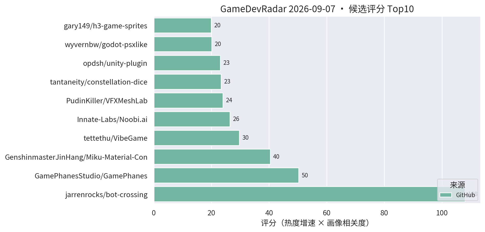
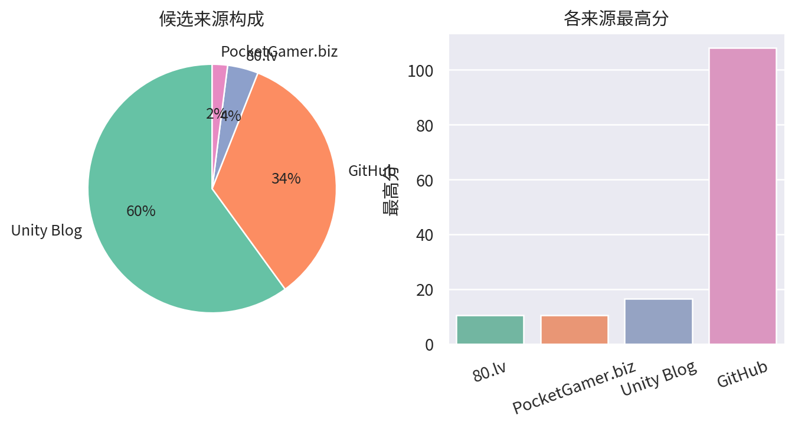

# 游戏开发技术雷达 · 2026-09-07（LLM 点评版）

**今日看点**
1. opdsh/unity-plugin 三天从 30★ 涨到 52★——用 CLI 让 AI 操控 Unity Editor 的插件持续升温，AI 驱动编辑器工作流是本周最强信号。
2. bot-crossing（给 AI agent 玩的游戏）180★/5天 继续霸榜，fork 58 个，"AI 玩游戏"赛道的实际动手比例很高。
3. Miku 材质管线（Blender→URP Shader Graph）稳步逼近 200★，TA 圈对它的关注度在持续累积。

| # | 评分 | 项目 / 话题 | 来源 | 信号 | 简介 | 点评 |
|---|---|---|---|---|---|---|
| 1 | 108.0 | [jarrenrocks/bot-crossing](https://github.com/jarrenrocks/bot-crossing) | github | 180★ / 5天 | A video game for AI agents. | 专为 AI agent 设计的游戏，热度连续三天榜首；它的 agent 交互协议值得做 AI 工作流/游戏 AI 的人花 5 分钟研究。 |
| 2 | 50.25 | [GamePhanesStudio/GamePhanes](https://github.com/GamePhanesStudio/GamePhanes) | github | 536★ / 16天 | An open-source game coding agent environment and benchmark for Godot. | "AI 做游戏"的开源评测环境（Godot 向）；作为 AI 编码能力标尺保持趋势级关注。 |
| 3 | 40.4 | [GenshinmasterJinHang/Miku-Material-Converter-Blender-to-Unity-](https://github.com/GenshinmasterJinHang/Miku-Material-Converter-Blender-to-Unity-) | github | 187★ / 37天 | Miku is an open-source material conversion pipeline that translates Blender 5.2 Shader Nodes into editable Unity 6 URP Shader Graph assets. | Blender Shader Nodes 转 URP Shader Graph 的材质管线，带中间表示与诊断；TA/管线向强烈推荐，DCC 到引擎的材质断层它真在补。 |
| 4 | 29.68 | [tettethu/VibeGame](https://github.com/tettethu/VibeGame) | github | 212★ / 25天 | VibeGame: Vibe Your Dream Game -- self-evolving multi-agent framework with an AI-Native game engine. | 自然语言生成 2D 网页游戏的多智能体框架；概念热度延续，看趋势即可，离商业手游管线尚远。 |
| 5 | 26.46 | [Innate-Labs/Noobi.ai](https://github.com/Innate-Labs/Noobi.ai) | github | 247★ / 28天 | Local-first desktop agent that turns a prompt into a reviewed, playable browser game. | 本地优先的游戏生成 agent，亮点是生成后带 review 闭环；关注 AI 工作流的可借鉴其评审设计。 |
| 6 | 24.0 | [PudinKiller/VFXMeshLab](https://github.com/PudinKiller/VFXMeshLab) | github | 101★ / 42天 | Unity 6 URP editor tool for procedural VFX mesh authoring, modifiers, diagnostics. | URP 程序化特效网格编辑工具，带修改器和引用安全更新；做技能特效的直接 clone，省手写特效 mesh 的功夫。 |
| 7 | 23.31 | [tantaneity/constellation-dice](https://github.com/tantaneity/constellation-dice) | github | 20★ / 6天 | Astral dice in Unity URP: nebula, stars and per-face constellations in a single raymarch pass. | URP 单 raymarch pass 的星座骰子；小而美、技术密度高，写体积 shader 的值得拆。 |
| 8 | 23.12 | [opdsh/unity-plugin](https://github.com/opdsh/unity-plugin) | github | 52★ / 9天 | DeepSeek Harness plugin: control the Unity Editor through the unity CLI. | 通过 CLI 让 AI 操控 Unity Editor 的插件，三天涨 22★ 升温明显；AI 驱动编辑器是当下最值得跟踪的工作流方向。 |
| 9 | 19.95 | [gary149/h3-game-sprites](https://github.com/gary149/h3-game-sprites) | github | 114★ / 20天 | Agent Skill: turn AI-generated video into 2D game sprite sheets (the Mortal Kombat method). | AI 视频转 2D 序列帧的 Agent Skill（真人快打式管线）；2D 美术管线可借鉴，AI 工作流关注者必看。 |
| 10 | 19.85 | [thrixel/build-world](https://github.com/thrixel/build-world) | github | 71★ / 34天 | Build interactive 3D worlds with high-quality assets from Thrixel and your AI agent. | AI agent + 素材库搭 3D 世界（three.js 向）；原型阶段工具，趋势级关注。 |
| 11 | 16.5 | [Backyard Baseball 3D 关卡与 VFX 复盘](https://unity.com/blog/reimagining-backyard-baseball-3d-level-design-and-environment-art) | Unity Blog | 官方发布 | Mega Cat Studios 用可读性关卡设计、decal、灯光和 VFX 把 Backyard Baseball 2026 做成 3D。 | 官方案例：decal + 灯光的可读性关卡设计，对移动端场景表现力有参考价值。 |
| 12 | 16.5 | [权力的游戏 Dragonfire 移动端优化](https://unity.com/blog/building-westeros-for-mobile-in-game-of-thrones-dragonfire) | Unity Blog | 官方发布 | WB Games Boston 如何为移动端优化可扩展多人、加载速度与 Unity 工具链。 | 大 IP 手游的加载与多人优化复盘，商业手游开发者直接对口，值得读。 |
| 13 | 15.0 | [Sente 六人策略的数据驱动棋盘](https://unity.com/blog/data-driven-board-six-player-strategy-sente) | Unity Blog | 官方发布 | Oxobox 用 Timeline + 数据驱动棋盘做六人同时回合制策略游戏。 | 数据驱动棋盘 + Timeline 表现层，做战棋/卡牌的架构可参考。 |
| 14 | 15.0 | [Causa: Into the Dusk 的 Unity 6.3 移动端移植](https://unity.com/blog/adapting-causa-into-the-dusk-for-mobile) | Unity Blog | 官方发布 | Niebla Games 把 2021 年的 PC 游戏搬上 Google Play Pass 的实战视频。 | 少见的 PC→手游移植实战分享，做移植或多平台适配的值得看。 |

---
*由 GameDevRadar 生成 · 点评由 LLM 按 profile.json 画像撰写 · 原始榜单见 daily.md*
