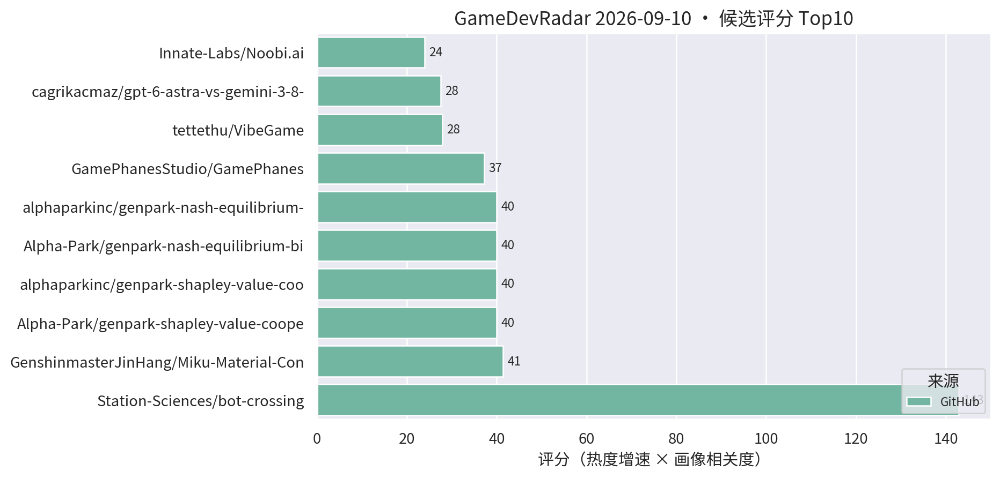
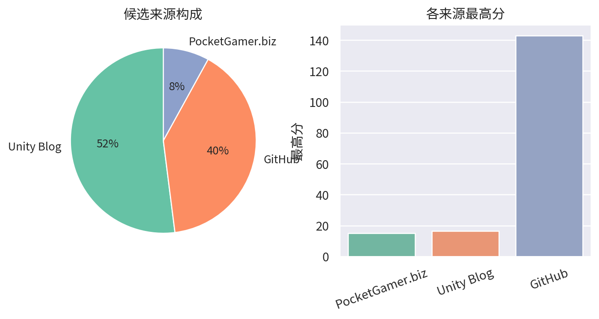

# 游戏开发技术雷达 · 2026-09-10（LLM 点评版）

**今日看点**
1. bot-crossing 八天 381★、单日净增百星——"给 AI agent 玩的游戏"是近期增速最猛的开源项目，没有之一。
2. 今日四个 genpark 条目是博弈论（Shapley 值/纳什均衡）求解器而非游戏开发工具，且两个账号重复发布，已按规则剔除——注意甄别"game theory"与"game dev"的关键词噪音。
3. Miku 材质管线 207★ 稳步上行，GPT-6 vs Gemini 同题造游戏的对照实验仓进入第三天仍在榜。

| # | 评分 | 项目 / 话题 | 来源 | 信号 | 简介 | 点评 |
|---|---|---|---|---|---|---|
| 1 | 142.86 | [Station-Sciences/bot-crossing](https://github.com/Station-Sciences/bot-crossing) | github | 381★ / 8天 | A video game for AI agents. Created by Jarren Rocks. | 给 AI agent 玩的游戏，单日净增百星、加速爆发；做 AI 工作流/游戏 AI 的值得看它的 agent 交互协议设计。 |
| 2 | 41.36 | [GenshinmasterJinHang/Miku-Material-Converter-Blender-to-Unity-](https://github.com/GenshinmasterJinHang/Miku-Material-Converter-Blender-to-Unity-) | github | 207★ / 40天 | Miku is an open-source material conversion pipeline that translates Blender 5.2 Shader Nodes into editable Unity 6 URP Shader Graph assets. | Blender Shader Nodes 转 URP Shader Graph 的材质管线；TA/管线向强烈推荐，DCC 到引擎的材质断层它真在补。 |
| 3 | 37.19 | [GamePhanesStudio/GamePhanes](https://github.com/GamePhanesStudio/GamePhanes) | github | 471★ / 19天 | An open-source game coding agent environment and benchmark for Godot. | "AI 做游戏"的开源评测环境（Godot 向）；作为 AI 编码能力标尺保持趋势级关注。 |
| 4 | 27.86 | [tettethu/VibeGame](https://github.com/tettethu/VibeGame) | github | 223★ / 28天 | VibeGame: Vibe Your Dream Game -- self-evolving multi-agent framework with an AI-Native game engine. | 自然语言生成 2D 网页游戏的多智能体框架；热度延续，看趋势即可，离商业手游管线尚远。 |
| 5 | 27.5 | [cagrikacmaz/gpt-6-astra-vs-gemini-3-8-flash](https://github.com/cagrikacmaz/gpt-6-astra-vs-gemini-3-8-flash) | github | 15★ / 3天 | Same-brief agentic build comparison: GPT-6 Astra High vs Gemini 3.8 Flash High building a playable 3D AI civilization simulation game. | 同题对比两大前沿模型 agentic 造 3D 文明模拟游戏；形式新颖，关注 AI 编码工作流的值得看过程差异。 |
| 6 | 23.91 | [Innate-Labs/Noobi.ai](https://github.com/Innate-Labs/Noobi.ai) | github | 247★ / 31天 | Local-first desktop agent that turns a prompt into a reviewed, playable browser game. | 本地优先的游戏生成 agent，亮点是生成后带 review 闭环；关注 AI 工作流的可借鉴其评审设计。 |
| 7 | 18.52 | [thrixel/build-world](https://github.com/thrixel/build-world) | github | 72★ / 37天 | Build interactive 3D worlds with high-quality assets from Thrixel and your AI agent. | AI agent + 素材库搭 3D 世界（three.js 向）；原型阶段工具，趋势级关注。 |
| 8 | 17.5 | [gary149/h3-game-sprites](https://github.com/gary149/h3-game-sprites) | github | 115★ / 23天 | Agent Skill: turn AI-generated video into 2D game sprite sheets (the Mortal Kombat method). | AI 视频转 2D 序列帧的 Agent Skill；2D 美术管线可借鉴的邪道打法，AI 工作流关注者必看。 |
| 9 | 17.32 | [opdsh/unity-plugin](https://github.com/opdsh/unity-plugin) | github | 52★ / 12天 | DeepSeek Harness plugin: control the Unity Editor through the unity CLI. | 通过 CLI 让 AI 操控 Unity Editor 的插件；增速走平，AI 驱动编辑器工作流保持跟踪即可。 |
| 10 | 16.5 | [Backyard Baseball 3D 关卡与 VFX 复盘](https://unity.com/blog/reimagining-backyard-baseball-3d-level-design-and-environment-art) | Unity Blog | 官方发布 | Mega Cat Studios 用可读性关卡设计、decal、灯光和 VFX 把 Backyard Baseball 2026 做成 3D。 | 官方案例：decal + 灯光的可读性关卡设计，对移动端场景表现力有参考价值。 |
| 11 | 16.5 | [权力的游戏 Dragonfire 移动端优化](https://unity.com/blog/building-westeros-for-mobile-in-game-of-thrones-dragonfire) | Unity Blog | 官方发布 | WB Games Boston 如何为移动端优化可扩展多人、加载速度与 Unity 工具链。 | 大 IP 手游的加载与多人优化复盘，商业手游开发者直接对口，值得读。 |
| 12 | 15.54 | [tantaneity/constellation-dice](https://github.com/tantaneity/constellation-dice) | github | 20★ / 9天 | Astral dice in Unity URP: nebula, stars and per-face constellations in a single raymarch pass. | URP 单 raymarch pass 的星座骰子；小而美、技术密度高，写体积 shader 的值得拆。 |
| 13 | 15.0 | [Sente 六人策略的数据驱动棋盘](https://unity.com/blog/data-driven-board-six-player-strategy-sente) | Unity Blog | 官方发布 | Oxobox 用 Timeline + 数据驱动棋盘做六人同时回合制策略游戏。 | 数据驱动棋盘 + Timeline 表现层，做战棋/卡牌的架构可参考。 |

---
*由 GameDevRadar 生成 · 点评由 LLM 按 profile.json 画像撰写 · 原始榜单见 daily.md*
