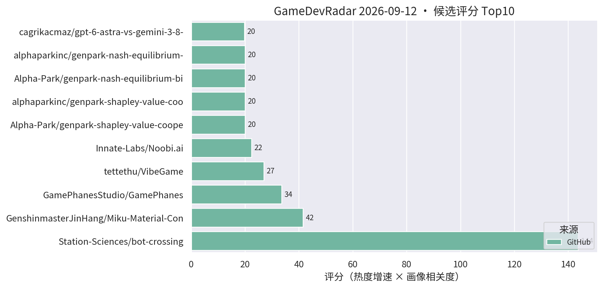
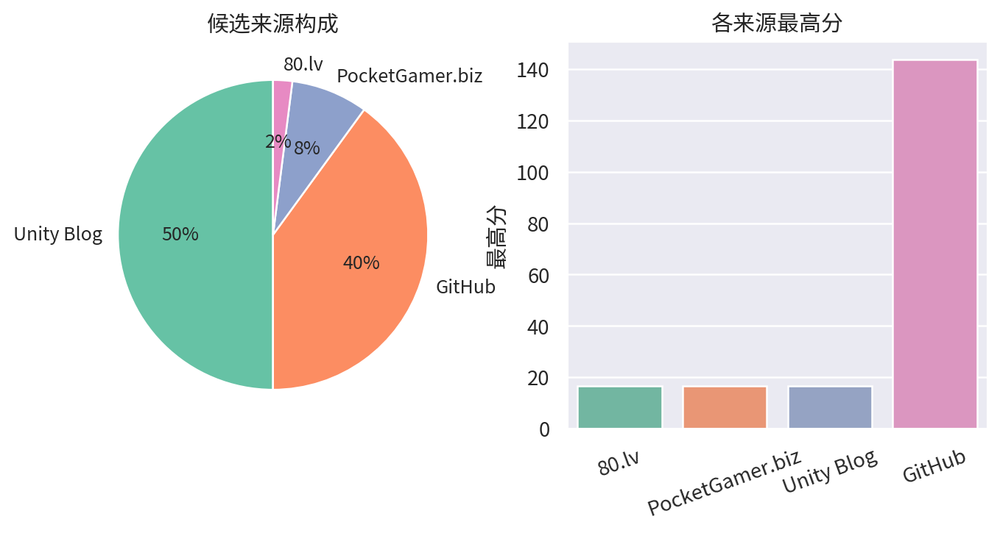

# 游戏开发技术雷达 · 2026-09-12（LLM 点评版）

**今日看点**
1. bot-crossing 十天 479★ 逼近 500，"给 AI agent 玩的游戏"稳坐本周现象级项目。
2. 80.lv 新报道 EchoForge：用空间音频在 Unity 里构建 3D 世界——声音驱动场景生成是个有意思的新工作流切口。
3. Unity 官方 Claude Code 插件新闻连续第二天在榜，AI 驱动编辑器官方化的讨论热度还在发酵。

| # | 评分 | 项目 / 话题 | 来源 | 信号 | 简介 | 点评 |
|---|---|---|---|---|---|---|
| 1 | 143.7 | [Station-Sciences/bot-crossing](https://github.com/Station-Sciences/bot-crossing) | github | 479★ / 10天 | A video game for AI agents. Created by Jarren Rocks. | 给 AI agent 玩的游戏，十天逼近 500★；做 AI 工作流/游戏 AI 的值得看它的 agent 交互协议设计。 |
| 2 | 41.52 | [GenshinmasterJinHang/Miku-Material-Converter-Blender-to-Unity-](https://github.com/GenshinmasterJinHang/Miku-Material-Converter-Blender-to-Unity-) | github | 218★ / 42天 | Miku is an open-source material conversion pipeline that translates Blender 5.2 Shader Nodes into editable Unity 6 URP Shader Graph assets. | Blender Shader Nodes 转 URP Shader Graph 的材质管线；TA/管线向强烈推荐，DCC 到引擎的材质断层它真在补。 |
| 3 | 33.64 | [GamePhanesStudio/GamePhanes](https://github.com/GamePhanesStudio/GamePhanes) | github | 471★ / 21天 | An open-source game coding agent environment and benchmark for Godot. | "AI 做游戏"的开源评测环境（Godot 向）；作为 AI 编码能力标尺保持趋势级关注。 |
| 4 | 26.95 | [tettethu/VibeGame](https://github.com/tettethu/VibeGame) | github | 231★ / 30天 | VibeGame: Vibe Your Dream Game -- self-evolving multi-agent framework with an AI-Native game engine. | 自然语言生成 2D 网页游戏的多智能体框架；热度延续，看趋势即可，离商业手游管线尚远。 |
| 5 | 22.44 | [Innate-Labs/Noobi.ai](https://github.com/Innate-Labs/Noobi.ai) | github | 247★ / 33天 | Local-first desktop agent that turns a prompt into a reviewed, playable browser game. | 本地优先的游戏生成 agent，亮点是生成后带 review 闭环；关注 AI 工作流的可借鉴其评审设计。 |
| 6 | 19.8 | [cagrikacmaz/gpt-6-astra-vs-gemini-3-8-flash](https://github.com/cagrikacmaz/gpt-6-astra-vs-gemini-3-8-flash) | github | 18★ / 5天 | Same-brief agentic build comparison: GPT-6 Astra High vs Gemini 3.8 Flash High building a playable 3D AI civilization simulation game. | 同题对比两大前沿模型 agentic 造 3D 文明模拟游戏；形式新颖，关注 AI 编码工作流的值得看过程差异。 |
| 7 | 17.77 | [thrixel/build-world](https://github.com/thrixel/build-world) | github | 73★ / 39天 | Build interactive 3D worlds with high-quality assets from Thrixel and your AI agent. | AI agent + 素材库搭 3D 世界（three.js 向）；原型阶段工具，趋势级关注。 |
| 8 | 16.66 | [gary149/h3-game-sprites](https://github.com/gary149/h3-game-sprites) | github | 119★ / 25天 | Agent Skill: turn AI-generated video into 2D game sprite sheets (the Mortal Kombat method). | AI 视频转 2D 序列帧的 Agent Skill；2D 美术管线可借鉴的邪道打法，AI 工作流关注者必看。 |
| 9 | 16.5 | [Backyard Baseball 3D 关卡与 VFX 复盘](https://unity.com/blog/reimagining-backyard-baseball-3d-level-design-and-environment-art) | Unity Blog | 官方发布 | Mega Cat Studios 用可读性关卡设计、decal、灯光和 VFX 把 Backyard Baseball 2026 做成 3D。 | 官方案例：decal + 灯光的可读性关卡设计，对移动端场景表现力有参考价值。 |
| 10 | 16.5 | [权力的游戏 Dragonfire 移动端优化](https://unity.com/blog/building-westeros-for-mobile-in-game-of-thrones-dragonfire) | Unity Blog | 官方发布 | WB Games Boston 如何为移动端优化可扩展多人、加载速度与 Unity 工具链。 | 大 IP 手游的加载与多人优化复盘，商业手游开发者直接对口，值得读。 |
| 11 | 16.5 | [Unity 发布官方 Claude Code 插件，内置 29 个引擎技能](https://www.pocketgamer.biz/unity-launches-official-claude-code-plugin-with-29-built-in-engine-skills/) | PocketGamer.biz | 官方发布 | Unity has launched an official plugin for Claude Code to bring engine skills to the AI coding tool. | Unity 官方拥抱 AI 编码助手，29 个引擎技能接入 Claude Code；官方化意味着 AI 驱动编辑器将成标配，值得持续关注落地细节。 |
| 12 | 16.5 | [EchoForge 用空间音频在 Unity 里构建 3D 世界](https://80.lv/articles/echoforge-uses-spatial-sound-to-build-3d-worlds-in-unity/) | 80.lv | 官方发布 | Researchers Anamaria Buliga and Kamil Tebani explain how EchoForge uses spatial sound to build 3D worlds in Unity. | 声音驱动 3D 场景生成的新工作流；偏研究向，但对音频驱动玩法/程序化场景的团队是个新鲜切口，值得 5 分钟。 |
| 13 | 15.16 | [opdsh/unity-plugin](https://github.com/opdsh/unity-plugin) | github | 53★ / 14天 | DeepSeek Harness plugin: control the Unity Editor through the unity CLI. | CLI 驱动 Unity Editor 的社区插件；可对照官方 Claude Code 插件看社区方案的能力边界。 |

---
*由 GameDevRadar 生成 · 点评由 LLM 按 profile.json 画像撰写 · 原始榜单见 daily.md*
