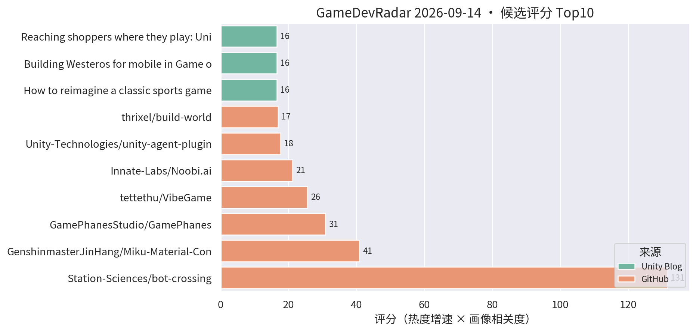
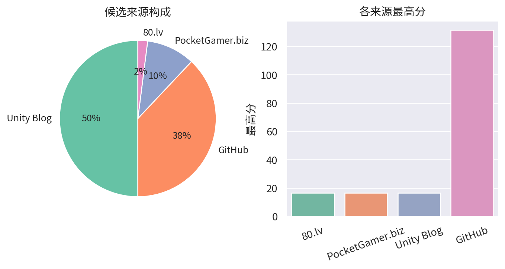

# 游戏开发技术雷达 · 2026-09-14（LLM 点评版）

**今日看点**
1. unity-agent-plugin（Unity 官方 agent 平台接入插件）升至第 6、223★——官方 AI agent 基建的社区关注度在快速爬升，AI 工作流方向持续加码。
2. bot-crossing 十二天 526★，增速放缓但仍居榜首，赛道进入沉淀期。
3. 昨日网络故障已恢复，09-13 点评版已补推；今日榜单结构与前几日同源，无新面孔，适合把之前标记的项目集中看一轮。

| # | 评分 | 项目 / 话题 | 来源 | 信号 | 简介 | 点评 |
|---|---|---|---|---|---|---|
| 1 | 131.49 | [Station-Sciences/bot-crossing](https://github.com/Station-Sciences/bot-crossing) | github | 526★ / 12天 | A video game for AI agents. Created by Jarren Rocks. | 给 AI agent 玩的游戏，12 天 526★ 进入沉淀期；做 AI 工作流/游戏 AI 的值得看它的 agent 交互协议设计。 |
| 2 | 40.88 | [GenshinmasterJinHang/Miku-Material-Converter-Blender-to-Unity-](https://github.com/GenshinmasterJinHang/Miku-Material-Converter-Blender-to-Unity-) | github | 225★ / 44天 | Miku is an open-source material conversion pipeline that translates Blender 5.2 Shader Nodes into editable Unity 6 URP Shader Graph assets. | Blender Shader Nodes 转 URP Shader Graph 的材质管线；TA/管线向强烈推荐，DCC 到引擎的材质断层它真在补。 |
| 3 | 30.86 | [GamePhanesStudio/GamePhanes](https://github.com/GamePhanesStudio/GamePhanes) | github | 473★ / 23天 | An open-source game coding agent environment and benchmark for Godot. | "AI 做游戏"的开源评测环境（Godot 向）；作为 AI 编码能力标尺保持趋势级关注。 |
| 4 | 25.58 | [tettethu/VibeGame](https://github.com/tettethu/VibeGame) | github | 234★ / 32天 | VibeGame: Vibe Your Dream Game -- self-evolving multi-agent framework with an AI-Native game engine. | 自然语言生成 2D 网页游戏的多智能体框架；热度延续，看趋势即可，离商业手游管线尚远。 |
| 5 | 21.18 | [Innate-Labs/Noobi.ai](https://github.com/Innate-Labs/Noobi.ai) | github | 247★ / 35天 | Local-first desktop agent that turns a prompt into a reviewed, playable browser game. | 本地优先的游戏生成 agent，亮点是生成后带 review 闭环；关注 AI 工作流的可借鉴其评审设计。 |
| 6 | 17.61 | [Unity-Technologies/unity-agent-plugin](https://github.com/Unity-Technologies/unity-agent-plugin) | github | 223★ / 38天 | Unity plugin for third-party agent platforms. | Unity 官方出品的第三方 agent 平台接入插件，日增 14★ 加速中；AI agent 接入引擎已是官方战略，做 AI 工作流的必看。 |
| 7 | 16.91 | [thrixel/build-world](https://github.com/thrixel/build-world) | github | 73★ / 41天 | Build interactive 3D worlds with high-quality assets from Thrixel and your AI agent. | AI agent + 素材库搭 3D 世界（three.js 向）；原型阶段工具，趋势级关注。 |
| 8 | 16.5 | [Backyard Baseball 3D 关卡与 VFX 复盘](https://unity.com/blog/reimagining-backyard-baseball-3d-level-design-and-environment-art) | Unity Blog | 官方发布 | Mega Cat Studios 用可读性关卡设计、decal、灯光和 VFX 把 Backyard Baseball 2026 做成 3D。 | 官方案例：decal + 灯光的可读性关卡设计，对移动端场景表现力有参考价值。 |
| 9 | 16.5 | [权力的游戏 Dragonfire 移动端优化](https://unity.com/blog/building-westeros-for-mobile-in-game-of-thrones-dragonfire) | Unity Blog | 官方发布 | WB Games Boston 如何为移动端优化可扩展多人、加载速度与 Unity 工具链。 | 大 IP 手游的加载与多人优化复盘，商业手游开发者直接对口，值得读。 |
| 10 | 16.5 | [Unity 发布官方 Claude Code 插件，内置 29 个引擎技能](https://www.pocketgamer.biz/unity-launches-official-claude-code-plugin-with-29-built-in-engine-skills/) | PocketGamer.biz | 官方发布 | Unity has launched an official plugin for Claude Code to bring engine skills to the AI coding tool. | Unity 官方拥抱 AI 编码助手；与 unity-agent-plugin 结合看，官方 AI 工具链布局已成型，值得花时间评估接入。 |
| 11 | 16.5 | [EchoForge 用空间音频在 Unity 里构建 3D 世界](https://80.lv/articles/echoforge-uses-spatial-sound-to-build-3d-worlds-in-unity/) | 80.lv | 官方发布 | Researchers explain how EchoForge uses spatial sound to build 3D worlds in Unity. | 声音驱动 3D 场景生成的新工作流；偏研究向，对音频驱动玩法/程序化场景的团队是个新鲜切口。 |
| 12 | 15.54 | [gary149/h3-game-sprites](https://github.com/gary149/h3-game-sprites) | github | 120★ / 27天 | Agent Skill: turn AI-generated video into 2D game sprite sheets (the Mortal Kombat method). | AI 视频转 2D 序列帧的 Agent Skill；2D 美术管线可借鉴的邪道打法，AI 工作流关注者必看。 |
| 13 | 15.0 | [Sente 六人策略的数据驱动棋盘](https://unity.com/blog/data-driven-board-six-player-strategy-sente) | Unity Blog | 官方发布 | Oxobox 用 Timeline + 数据驱动棋盘做六人同时回合制策略游戏。 | 数据驱动棋盘 + Timeline 表现层，做战棋/卡牌的架构可参考。 |
| 14 | 15.0 | [Causa: Into the Dusk 的 Unity 6.3 移动端移植](https://unity.com/blog/adapting-causa-into-the-dusk-for-mobile) | Unity Blog | 官方发布 | Niebla Games 把 2021 年的 PC 游戏搬上 Google Play Pass 的实战视频。 | 少见的 PC→手游移植实战分享，做移植或多平台适配的值得看。 |

---
*由 GameDevRadar 生成 · 点评由 LLM 按 profile.json 画像撰写 · 原始榜单见 daily.md*
