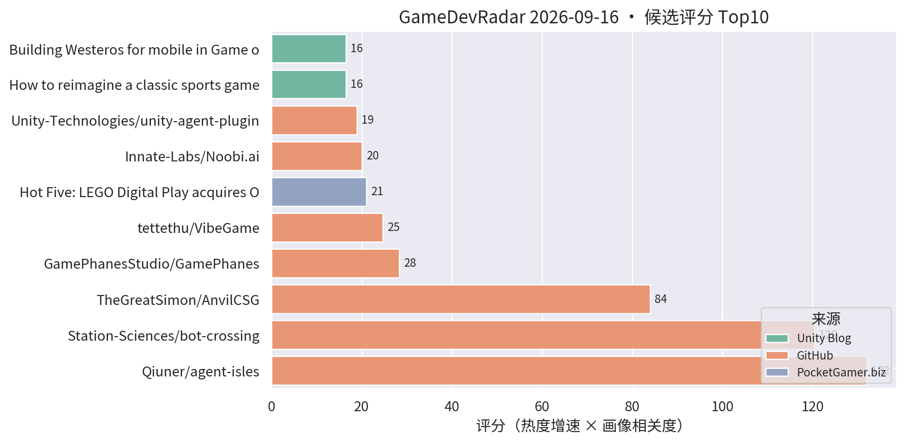
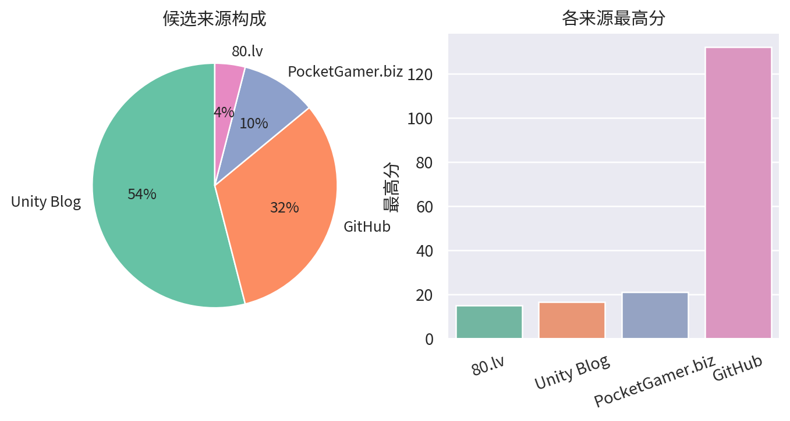

# 游戏开发技术雷达 · 2026-09-16（LLM 点评版）

**今日看点**
1. 榜首易主：Qiuner/agent-isles 首日 33★ 空降第一——游戏化岛屿世界学 AI 编码（DeepSeek Harness 驱动），"用游戏的方式教 agent 工作流"又添新玩法。
2. AnvilCSG（Hammer 式笔刷关卡设计，支持 URP）次日评分 84，从 3★ 涨到 14★——Unity 关卡白盒工具的需求被迅速验证。
3. NaughtyAttributes 被移植到 Godot（NaughtyAttributesGD）：Unity 老牌编辑器属性工具的"外流"，侧面反映 Godot 工具生态在系统性补 Unity 的课。

| # | 评分 | 项目 / 话题 | 来源 | 信号 | 简介 | 点评 |
|---|---|---|---|---|---|---|
| 1 | 132.0 | [Qiuner/agent-isles](https://github.com/Qiuner/agent-isles) | github | 33★ / 1天 | An explorable island world to learn AI coding and build real projects with AI agents. Powered by DeepSeek Harness. | 游戏化岛屿世界学 AI 编码（Godot 做壳、DeepSeek Harness 驱动）；把"教 agent 工作流"做成游戏，形式新颖，趋势级关注。 |
| 2 | 120.42 | [Station-Sciences/bot-crossing](https://github.com/Station-Sciences/bot-crossing) | github | 562★ / 14天 | A video game for AI agents. Created by Jarren Rocks. | 给 AI agent 玩的游戏，14 天 562★ 稳增；做 AI 工作流/游戏 AI 的值得看它的 agent 交互协议设计。 |
| 3 | 84.0 | [TheGreatSimon/AnvilCSG](https://github.com/TheGreatSimon/AnvilCSG) | github | 14★ / 1天 | Anvil CSG Beta 2: a free legacy preview of brush-based level design inside Unity. Hammer-inspired workflow, Built-in and URP. | Hammer 式笔刷关卡设计工具，Unity 内免费用、支持 URP；次日星数翻四倍，做关卡白盒的值得立刻试。 |
| 4 | 28.38 | [GamePhanesStudio/GamePhanes](https://github.com/GamePhanesStudio/GamePhanes) | github | 473★ / 25天 | An open-source game coding agent environment and benchmark for Godot. | "AI 做游戏"的开源评测环境（Godot 向）；作为 AI 编码能力标尺保持趋势级关注。 |
| 5 | 24.71 | [tettethu/VibeGame](https://github.com/tettethu/VibeGame) | github | 240★ / 34天 | VibeGame: Vibe Your Dream Game -- self-evolving multi-agent framework with an AI-Native game engine. | 自然语言生成 2D 网页游戏的多智能体框架；热度延续，看趋势即可，离商业手游管线尚远。 |
| 6 | 21.0 | [PocketGamer 一周热点：Unity 官方 Claude Code 插件、乐高收购 Offroad、Pokémon Go 登顶](https://www.pocketgamer.biz/hot-five-lego-digital-play-acquires-offroad-games-unity-launches-claude-code-plugin-and-pokemon-go-is-top-grossing-mobile-game-of-early-september/) | PocketGamer.biz | 官方发布 | 过去七天手游行业大事汇总。 | 手游行业周报式汇总，5 分钟补齐一周行业动态；Unity 官方 Claude Code 插件排头条，印证其分量。 |
| 7 | 20.1 | [Innate-Labs/Noobi.ai](https://github.com/Innate-Labs/Noobi.ai) | github | 248★ / 37天 | Local-first desktop agent that turns a prompt into a reviewed, playable browser game. | 本地优先的游戏生成 agent，亮点是生成后带 review 闭环；关注 AI 工作流的可借鉴其评审设计。 |
| 8 | 18.99 | [Unity-Technologies/unity-agent-plugin](https://github.com/Unity-Technologies/unity-agent-plugin) | github | 253★ / 40天 | Unity plugin for third-party agent platforms. | Unity 官方出品的第三方 agent 平台接入插件，日增 10★ 稳涨；AI agent 接入引擎已是官方战略，做 AI 工作流的必看。 |
| 9 | 16.5 | [Backyard Baseball 3D 关卡与 VFX 复盘](https://unity.com/blog/reimagining-backyard-baseball-3d-level-design-and-environment-art) | Unity Blog | 官方发布 | Mega Cat Studios 用可读性关卡设计、decal、灯光和 VFX 把 Backyard Baseball 2026 做成 3D。 | 官方案例：decal + 灯光的可读性关卡设计，对移动端场景表现力有参考价值。 |
| 10 | 16.5 | [权力的游戏 Dragonfire 移动端优化](https://unity.com/blog/building-westeros-for-mobile-in-game-of-thrones-dragonfire) | Unity Blog | 官方发布 | WB Games Boston 如何为移动端优化可扩展多人、加载速度与 Unity 工具链。 | 大 IP 手游的加载与多人优化复盘，商业手游开发者直接对口，值得读。 |
| 11 | 16.5 | [Unity 发布官方 Claude Code 插件，内置 29 个引擎技能](https://www.pocketgamer.biz/unity-launches-official-claude-code-plugin-with-29-built-in-engine-skills/) | PocketGamer.biz | 官方发布 | Unity has launched an official plugin for Claude Code to bring engine skills to the AI coding tool. | Unity 官方拥抱 AI 编码助手；与 unity-agent-plugin 结合看，官方 AI 工具链布局已成型，值得花时间评估接入。 |
| 12 | 16.15 | [thrixel/build-world](https://github.com/thrixel/build-world) | github | 73★ / 43天 | Build interactive 3D worlds with high-quality assets from Thrixel and your AI agent. | AI agent + 素材库搭 3D 世界（three.js 向）；原型阶段工具，趋势级关注。 |
| 13 | 15.82 | [dbrizov/NaughtyAttributesGD](https://github.com/dbrizov/NaughtyAttributesGD) | github | 38★ / 6天 | NaughtyAttributes for Godot. | Unity 经典编辑器属性工具被移植到 Godot；趋势级信号——Godot 生态在系统性补 Unity 的课， Unity 开发者切换双引擎成本在降低。 |
| 14 | 15.0 | [Sente 六人策略的数据驱动棋盘](https://unity.com/blog/data-driven-board-six-player-strategy-sente) | Unity Blog | 官方发布 | Oxobox 用 Timeline + 数据驱动棋盘做六人同时回合制策略游戏。 | 数据驱动棋盘 + Timeline 表现层，做战棋/卡牌的架构可参考。 |
| 15 | 15.0 | [Causa: Into the Dusk 的 Unity 6.3 移动端移植](https://unity.com/blog/adapting-causa-into-the-dusk-for-mobile) | Unity Blog | 官方发布 | Niebla Games 把 2021 年的 PC 游戏搬上 Google Play Pass 的实战视频。 | 少见的 PC→手游移植实战分享，做移植或多平台适配的值得看。 |

---
*由 GameDevRadar 生成 · 点评由 LLM 按 profile.json 画像撰写 · 原始榜单见 daily.md*
