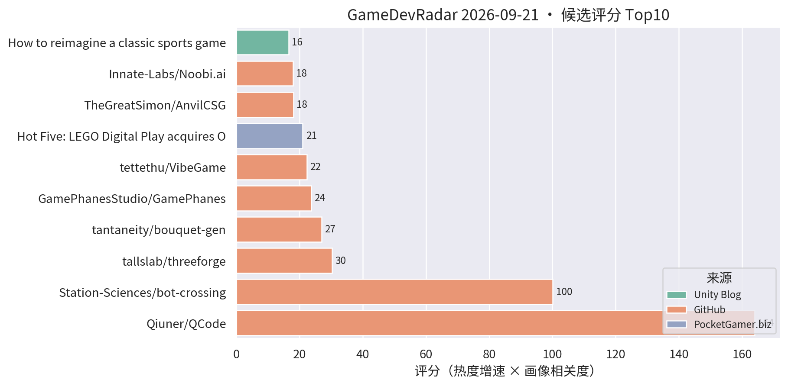
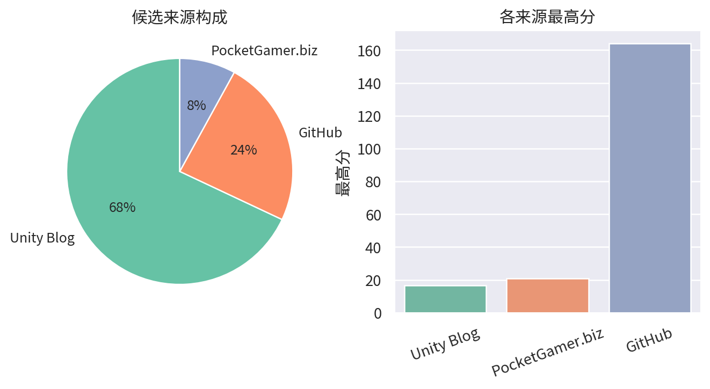

# 游戏开发技术雷达 · 2026-09-21（LLM 点评版）

> 注：今日 GitHub 部分查询因网络 SSL 错误被跳过，GitHub 侧候选覆盖不全，明日自动恢复。

**今日看点**
1. 新面孔 tallslab/threeforge：面向 three.js 游戏的"帧预算编译器"——自动合批、逐帧成本诊断、还带 MCP 接口给 AI agent 用，性能工具 + AI 工作流的杂交品种。
2. QCode 六天 246★ 继续霸榜；tantaneity 的 URP 程序化花束 bouquet-gen 次日评分升至 27，URP 程序化小品系列持续有货。
3. Unity 官方 Codex 插件、DRG Survivor 手游优化复盘连续在榜，官方 AI 工具链与手游性能实战仍是双主线。

| # | 评分 | 项目 / 话题 | 来源 | 信号 | 简介 | 点评 |
|---|---|---|---|---|---|---|
| 1 | 164.0 | [Qiuner/QCode](https://github.com/Qiuner/QCode) | github | 246★ / 6天 | An explorable island world to learn AI coding and build real projects with AI agents. Powered by DeepSeek Harness. | 游戏化岛屿世界学 AI 编码；六天 246★ 持续霸榜，趋势级关注它的玩法化教学设计。 |
| 2 | 100.11 | [Station-Sciences/bot-crossing](https://github.com/Station-Sciences/bot-crossing) | github | 634★ / 19天 | A video game for AI agents. Created by Jarren Rocks. | 给 AI agent 玩的游戏，19 天 634★；做 AI 工作流/游戏 AI 的值得看它的 agent 交互协议设计。 |
| 3 | 30.31 | [tallslab/threeforge](https://github.com/tallslab/threeforge) | github | 13★ / 3天 | Frame-budget compiler and diagnostics for three.js games: batches naive scenes, measures every frame cost, explains what to fix. CLI and MCP for AI agents. | three.js 游戏的帧预算编译+诊断工具，自动合批且带 MCP 给 AI agent 调用；虽是 web 向，"AI 驱动的性能诊断"思路对手游性能优化也有参考价值。 |
| 4 | 27.0 | [tantaneity/bouquet-gen](https://github.com/tantaneity/bouquet-gen) | github | 3★ / 1天 | Procedural flower bouquet in Unity URP, every petal built as procedural geometry. | URP 程序化花束生成，花瓣全程序化建模；该作者的 URP 程序化小品系列质量稳定，做程序化植被/装饰的可参考。 |
| 5 | 23.66 | [GamePhanesStudio/GamePhanes](https://github.com/GamePhanesStudio/GamePhanes) | github | 473★ / 30天 | An open-source game coding agent environment and benchmark for Godot. | "AI 做游戏"的开源评测环境（Godot 向）；作为 AI 编码能力标尺保持趋势级关注。 |
| 6 | 22.33 | [tettethu/VibeGame](https://github.com/tettethu/VibeGame) | github | 249★ / 39天 | VibeGame: Vibe Your Dream Game -- self-evolving multi-agent framework with an AI-Native game engine. | 自然语言生成 2D 网页游戏的多智能体框架；热度延续，看趋势即可。 |
| 7 | 21.0 | [PocketGamer 一周热点汇总](https://www.pocketgamer.biz/hot-five-lego-digital-play-acquires-offroad-games-unity-launches-claude-code-plugin-and-pokemon-go-is-top-grossing-mobile-game-of-early-september/) | PocketGamer.biz | 官方发布 | 过去七天手游行业大事：Unity 官方 Claude Code 插件、乐高收购 Offroad、Pokémon Go 登顶。 | 手游行业周报式汇总，5 分钟补齐一周行业动态。 |
| 8 | 18.0 | [TheGreatSimon/AnvilCSG](https://github.com/TheGreatSimon/AnvilCSG) | github | 18★ / 6天 | Anvil CSG Beta 2: a free legacy preview of brush-based level design inside Unity. Hammer-inspired workflow, Built-in and URP. | Hammer 式笔刷关卡设计工具，Unity 内免费用、支持 URP；做关卡白盒的值得立刻试。 |
| 9 | 17.94 | [Innate-Labs/Noobi.ai](https://github.com/Innate-Labs/Noobi.ai) | github | 251★ / 42天 | Local-first desktop agent that turns a prompt into a reviewed, playable browser game. | 本地优先的游戏生成 agent，亮点是生成后带 review 闭环；关注 AI 工作流的可借鉴其评审设计。 |
| 10 | 16.5 | [Backyard Baseball 3D 关卡与 VFX 复盘](https://unity.com/blog/reimagining-backyard-baseball-3d-level-design-and-environment-art) | Unity Blog | 官方发布 | Mega Cat Studios 用可读性关卡设计、decal、灯光和 VFX 把 Backyard Baseball 2026 做成 3D。 | 官方案例：decal + 灯光的可读性关卡设计，对移动端场景表现力有参考价值。 |
| 11 | 15.0 | [Deep Rock Galactic: Survivor 手游优化复盘](https://unity.com/blog/optimizing-deep-rock-galactic-survivor-for-mobile) | Unity Blog | 官方发布 | Piktiv 如何把 Deep Rock Galactic: Survivor 移植到移动端。 | 幸存者 like 爆款的手游移植优化复盘，海量同屏单位的性能处理对商业手游直接对口，值得细读。 |
| 12 | 15.0 | [Unity 官方 Codex 插件](https://unity.com/blog/unity-plugin-codex) | Unity Blog | 官方发布 | Unity's official plugin for Codex. | 官方 Codex 插件官宣，官方 AI 编码助手全家桶成型；做 AI 工作流的必看。 |
| 13 | 15.0 | [Sente 六人策略的数据驱动棋盘](https://unity.com/blog/data-driven-board-six-player-strategy-sente) | Unity Blog | 官方发布 | Oxobox 用 Timeline + 数据驱动棋盘做六人同时回合制策略游戏。 | 数据驱动棋盘 + Timeline 表现层，做战棋/卡牌的架构可参考。 |
| 14 | 15.0 | [Causa: Into the Dusk 的 Unity 6.3 移动端移植](https://unity.com/blog/adapting-causa-into-the-dusk-for-mobile) | Unity Blog | 官方发布 | Niebla Games 把 2021 年的 PC 游戏搬上 Google Play Pass 的实战视频。 | 少见的 PC→手游移植实战分享，做移植或多平台适配的值得看。 |
| 15 | 15.0 | [Playrix 用 D28 IAP ROAS 优化 Township 买量](https://unity.com/blog/playrix-township-roas-optimization-vector) | Unity Blog | 官方发布 | Playrix 用 Vector AI 和 D28 IAP ROAS 优化实现长线留存与营收。 | 头部厂商的长线 ROAS 优化实战，做商业化/买量对接的值得一看。 |

---
*由 GameDevRadar 生成 · 点评由 LLM 按 profile.json 画像撰写 · 原始榜单见 daily.md*
