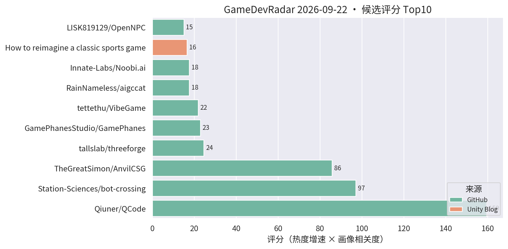
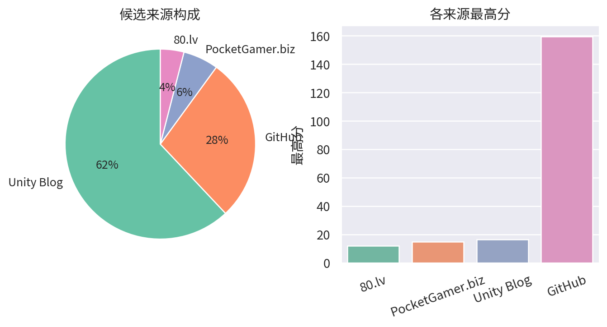

# 游戏开发技术雷达 · 2026-09-22（LLM 点评版）

**今日看点**
1. AnvilCSG 爆发：Hammer 式笔刷关卡设计工具一周冲到 100★（单日 +82），评分 85.7 空降第三——Unity 关卡白盒工具的需求彻底被点燃。
2. 新面孔 RainNameless/aigccat：自然语言/图片生成 3D 模型并完成贴图、减面、重拓扑、UV、绑骨、动画全管线，直交 Unity/Godot——AI 3D 资产管线做到"端到端交付"的少见尝试。
3. QCode 279★、bot-crossing 647★ 双榜领跑；OpenNPC（本地 LLM 人格化 NPC 框架）上榜，游戏 AI 方向持续有新血。

| # | 评分 | 项目 / 话题 | 来源 | 信号 | 简介 | 点评 |
|---|---|---|---|---|---|---|
| 1 | 159.44 | [Qiuner/QCode](https://github.com/Qiuner/QCode) | github | 279★ / 7天 | An explorable island world to learn AI coding and build real projects with AI agents. Powered by DeepSeek Harness. | 游戏化岛屿世界学 AI 编码；七天 279★ 持续霸榜，趋势级关注它的玩法化教学设计。 |
| 2 | 97.05 | [Station-Sciences/bot-crossing](https://github.com/Station-Sciences/bot-crossing) | github | 647★ / 20天 | A video game for AI agents. Created by Jarren Rocks. | 给 AI agent 玩的游戏，20 天 647★；做 AI 工作流/游戏 AI 的值得看它的 agent 交互协议设计。 |
| 3 | 85.74 | [TheGreatSimon/AnvilCSG](https://github.com/TheGreatSimon/AnvilCSG) | github | 100★ / 7天 | Anvil CSG Beta 2: a free legacy preview of brush-based level design inside Unity. Hammer-inspired workflow, Built-in and URP. | Hammer 式笔刷关卡设计工具，单日暴涨 82★ 破百；Unity 关卡白盒刚需被验证，做关卡/TA 的强烈建议试。 |
| 4 | 24.5 | [tallslab/threeforge](https://github.com/tallslab/threeforge) | github | 14★ / 4天 | Frame-budget compiler and diagnostics for three.js games: batches naive scenes, measures frame cost, CLI and MCP for AI agents. | three.js 帧预算编译+诊断工具，带 MCP 给 AI agent 调用；"AI 驱动性能诊断"的思路对手游性能优化有参考价值。 |
| 5 | 22.89 | [GamePhanesStudio/GamePhanes](https://github.com/GamePhanesStudio/GamePhanes) | github | 473★ / 31天 | An open-source game coding agent environment and benchmark for Godot. | "AI 做游戏"的开源评测环境（Godot 向）；作为 AI 编码能力标尺保持趋势级关注。 |
| 6 | 21.77 | [tettethu/VibeGame](https://github.com/tettethu/VibeGame) | github | 249★ / 40天 | VibeGame: Vibe Your Dream Game -- self-evolving multi-agent framework with an AI-Native game engine. | 自然语言生成 2D 网页游戏的多智能体框架；热度延续，看趋势即可。 |
| 7 | 17.6 | [RainNameless/aigccat](https://github.com/RainNameless/aigccat) | github | 22★ / 5天 | 用自然语言或图片生成 3D 模型，并完成贴图、减面、重拓扑、UV、绑骨、动画、版本管理、质量检测，最终直接交付 Unity / Godot。 | 国产 AI 3D 资产端到端管线：从提示词到可入引擎的成品模型含重拓扑绑骨全套；做 AI 美术工作流的值得重点看它的管线完整度。 |
| 8 | 17.58 | [Innate-Labs/Noobi.ai](https://github.com/Innate-Labs/Noobi.ai) | github | 252★ / 43天 | Local-first desktop agent that turns a prompt into a reviewed, playable browser game. | 本地优先的游戏生成 agent，亮点是生成后带 review 闭环；关注 AI 工作流的可借鉴其评审设计。 |
| 9 | 16.5 | [Backyard Baseball 3D 关卡与 VFX 复盘](https://unity.com/blog/reimagining-backyard-baseball-3d-level-design-and-environment-art) | Unity Blog | 官方发布 | Mega Cat Studios 用可读性关卡设计、decal、灯光和 VFX 把 Backyard Baseball 2026 做成 3D。 | 官方案例：decal + 灯光的可读性关卡设计，对移动端场景表现力有参考价值。 |
| 10 | 15.0 | [LISK819129/OpenNPC](https://github.com/LISK819129/OpenNPC) | github | 16★ / 8天 | A NPC AI Framework, based on character personalities, extendable for Godot / Unity (llama-cpp, local-LLM, LoRA). | 基于人格设定的本地 LLM NPC 框架，可扩展到 Unity/Godot；做 NPC 对话/AI 玩法的可以看看它的本地推理+人格建模思路。 |
| 11 | 15.0 | [Deep Rock Galactic: Survivor 手游优化复盘](https://unity.com/blog/optimizing-deep-rock-galactic-survivor-for-mobile) | Unity Blog | 官方发布 | Piktiv 如何把 Deep Rock Galactic: Survivor 移植到移动端。 | 幸存者 like 爆款的手游移植优化复盘，海量同屏单位的性能处理对商业手游直接对口，值得细读。 |
| 12 | 15.0 | [Unity 官方 Codex 插件](https://unity.com/blog/unity-plugin-codex) | Unity Blog | 官方发布 | Unity's official plugin for Codex. | 官方 Codex 插件官宣，官方 AI 编码助手全家桶成型；做 AI 工作流的必看。 |
| 13 | 15.0 | [Sente 六人策略的数据驱动棋盘](https://unity.com/blog/data-driven-board-six-player-strategy-sente) | Unity Blog | 官方发布 | Oxobox 用 Timeline + 数据驱动棋盘做六人同时回合制策略游戏。 | 数据驱动棋盘 + Timeline 表现层，做战棋/卡牌的架构可参考。 |
| 14 | 15.0 | [Causa: Into the Dusk 的 Unity 6.3 移动端移植](https://unity.com/blog/adapting-causa-into-the-dusk-for-mobile) | Unity Blog | 官方发布 | Niebla Games 把 2021 年的 PC 游戏搬上 Google Play Pass 的实战视频。 | 少见的 PC→手游移植实战分享，做移植或多平台适配的值得看。 |
| 15 | 15.0 | [Playrix 用 D28 IAP ROAS 优化 Township 买量](https://unity.com/blog/playrix-township-roas-optimization-vector) | Unity Blog | 官方发布 | Playrix 用 Vector AI 和 D28 IAP ROAS 优化实现长线留存与营收。 | 头部厂商的长线 ROAS 优化实战，做商业化/买量对接的值得一看。 |

---
*由 GameDevRadar 生成 · 点评由 LLM 按 profile.json 画像撰写 · 原始榜单见 daily.md*
