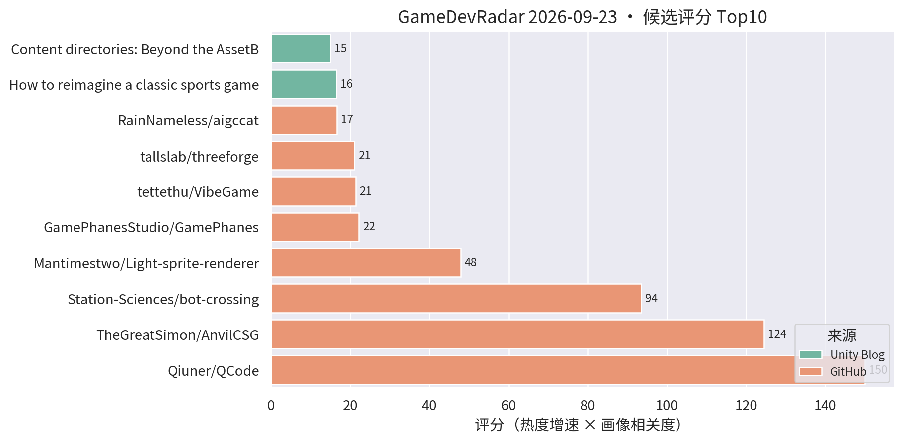
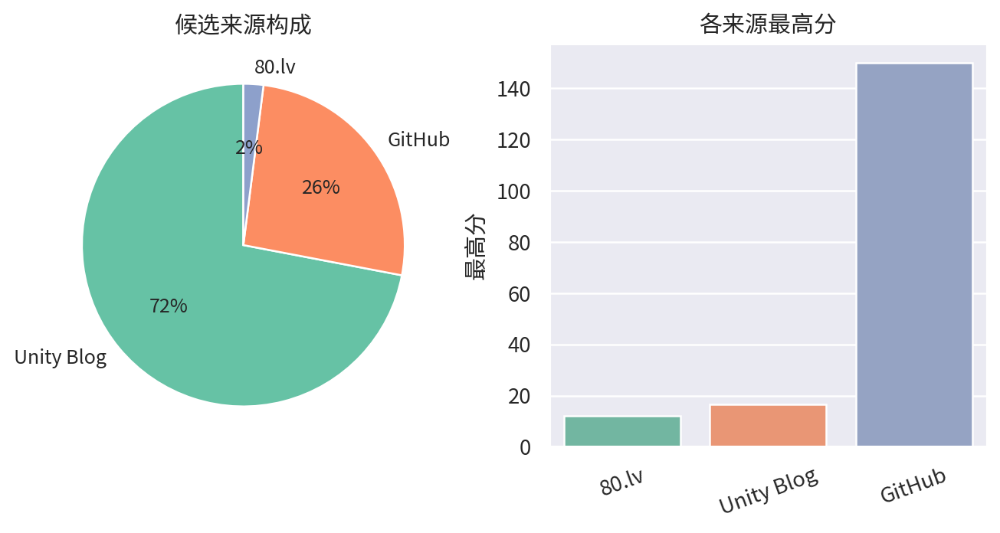

# 游戏开发技术雷达 · 2026-09-23（LLM 点评版）

**今日看点**
1. Unity 6.6 推出 content directories：比 AssetBundle 更快、粒度更细的资源系统，减构建时间、降包体、提加载性能，还支持远程分发——做热更/资源管理的一线开发者今天必看。
2. AnvilCSG 两天再从 100★ 冲到 166★，评分 124.5 超过 bot-crossing——Hammer 式笔刷关卡设计工具是本周增速第二极。
3. QCode 破 300★ 继续霸榜；aigccat（AI 3D 资产端到端管线直交 Unity）稳步爬升，AI 资产管线方向持续升温。

| # | 评分 | 项目 / 话题 | 来源 | 信号 | 简介 | 点评 |
|---|---|---|---|---|---|---|
| 1 | 150.0 | [Qiuner/QCode](https://github.com/Qiuner/QCode) | github | 300★ / 8天 | An explorable island world to learn AI coding and build real projects with AI agents. Powered by DeepSeek Harness. | 游戏化岛屿世界学 AI 编码；八天破 300★，趋势级关注它的玩法化教学设计。 |
| 2 | 124.5 | [TheGreatSimon/AnvilCSG](https://github.com/TheGreatSimon/AnvilCSG) | github | 166★ / 8天 | Anvil CSG Beta 2: a free legacy preview of brush-based level design inside Unity. Hammer-inspired workflow, Built-in and URP. | Hammer 式笔刷关卡设计工具，两天再涨 66★；Unity 关卡白盒刚需被持续验证，做关卡/TA 的强烈建议试。 |
| 3 | 93.57 | [Station-Sciences/bot-crossing](https://github.com/Station-Sciences/bot-crossing) | github | 655★ / 21天 | A video game for AI agents. Created by Jarren Rocks. | 给 AI agent 玩的游戏，21 天 655★；做 AI 工作流/游戏 AI 的值得看它的 agent 交互协议设计。 |
| 4 | 22.17 | [GamePhanesStudio/GamePhanes](https://github.com/GamePhanesStudio/GamePhanes) | github | 473★ / 32天 | An open-source game coding agent environment and benchmark for Godot. | "AI 做游戏"的开源评测环境（Godot 向）；作为 AI 编码能力标尺保持趋势级关注。 |
| 5 | 21.35 | [tettethu/VibeGame](https://github.com/tettethu/VibeGame) | github | 250★ / 41天 | VibeGame: Vibe Your Dream Game -- self-evolving multi-agent framework with an AI-Native game engine. | 自然语言生成 2D 网页游戏的多智能体框架；热度延续，看趋势即可。 |
| 6 | 21.0 | [tallslab/threeforge](https://github.com/tallslab/threeforge) | github | 15★ / 5天 | Frame-budget compiler and diagnostics for three.js games: batches naive scenes, measures frame cost, CLI and MCP for AI agents. | three.js 帧预算编译+诊断工具，带 MCP 给 AI agent 调用；"AI 驱动性能诊断"的思路对手游性能优化有参考价值。 |
| 7 | 16.68 | [RainNameless/aigccat](https://github.com/RainNameless/aigccat) | github | 25★ / 6天 | 用自然语言或图片生成 3D 模型，并完成贴图、减面、重拓扑、UV、绑骨、动画、版本管理、质量检测，最终直接交付 Unity / Godot。 | 国产 AI 3D 资产端到端管线：从提示词到可入引擎的成品模型含重拓扑绑骨全套；做 AI 美术工作流的值得重点看它的管线完整度。 |
| 8 | 16.5 | [Backyard Baseball 3D 关卡与 VFX 复盘](https://unity.com/blog/reimagining-backyard-baseball-3d-level-design-and-environment-art) | Unity Blog | 官方发布 | Mega Cat Studios 用可读性关卡设计、decal、灯光和 VFX 把 Backyard Baseball 2026 做成 3D。 | 官方案例：decal + 灯光的可读性关卡设计，对移动端场景表现力有参考价值。 |
| 9 | 15.0 | [Content directories：超越 AssetBundle](https://unity.com/blog/content-directories-beyond-the-assetbundle) | Unity Blog | 官方发布 | Unity 6.6 引入 content directories，更快更细粒度的 AssetBundle 替代方案，减构建时间、降包体、提加载性能，支持远程分发。 | 重磅官方功能：资源系统换代 + 远程分发内置，做热更/资源管理的一线开发者必看，直接影响商业手游的更新架构。 |
| 10 | 15.0 | [Deep Rock Galactic: Survivor 手游优化复盘](https://unity.com/blog/optimizing-deep-rock-galactic-survivor-for-mobile) | Unity Blog | 官方发布 | Piktiv 如何把 Deep Rock Galactic: Survivor 移植到移动端。 | 幸存者 like 爆款的手游移植优化复盘，海量同屏单位的性能处理对商业手游直接对口，值得细读。 |
| 11 | 15.0 | [Unity 官方 Codex 插件](https://unity.com/blog/unity-plugin-codex) | Unity Blog | 官方发布 | Unity's official plugin for Codex. | 官方 Codex 插件官宣，官方 AI 编码助手全家桶成型；做 AI 工作流的必看。 |
| 12 | 15.0 | [Sente 六人策略的数据驱动棋盘](https://unity.com/blog/data-driven-board-six-player-strategy-sente) | Unity Blog | 官方发布 | Oxobox 用 Timeline + 数据驱动棋盘做六人同时回合制策略游戏。 | 数据驱动棋盘 + Timeline 表现层，做战棋/卡牌的架构可参考。 |
| 13 | 15.0 | [Causa: Into the Dusk 的 Unity 6.3 移动端移植](https://unity.com/blog/adapting-causa-into-the-dusk-for-mobile) | Unity Blog | 官方发布 | Niebla Games 把 2021 年的 PC 游戏搬上 Google Play Pass 的实战视频。 | 少见的 PC→手游移植实战分享，做移植或多平台适配的值得看。 |
| 14 | 15.0 | [Playrix 用 D28 IAP ROAS 优化 Township 买量](https://unity.com/blog/playrix-township-roas-optimization-vector) | Unity Blog | 官方发布 | Playrix 用 Vector AI 和 D28 IAP ROAS 优化实现长线留存与营收。 | 头部厂商的长线 ROAS 优化实战，做商业化/买量对接的值得一看。 |

---
*由 GameDevRadar 生成 · 点评由 LLM 按 profile.json 画像撰写 · 原始榜单见 daily.md*
