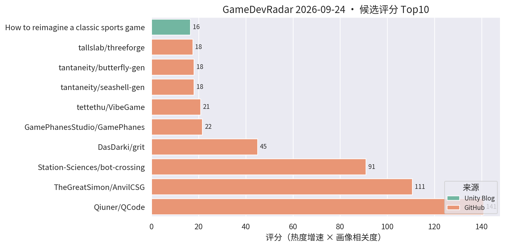
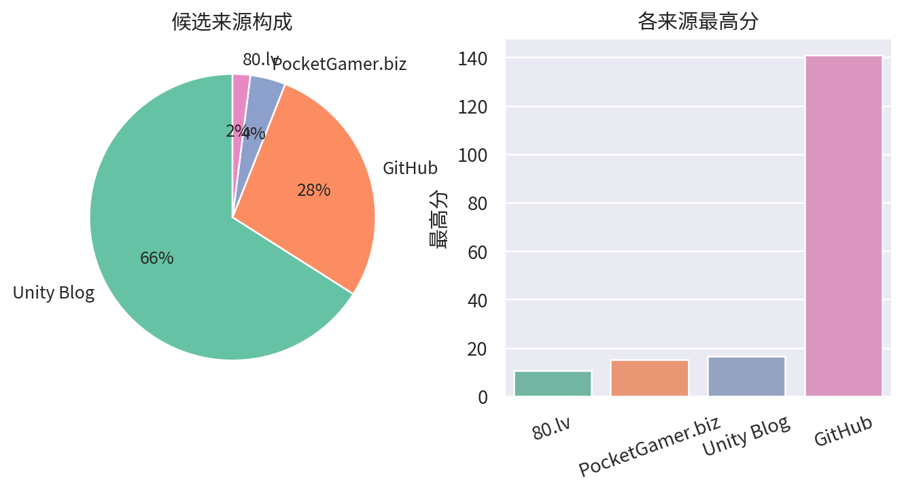

# 游戏开发技术雷达 · 2026-09-24（LLM 点评版）

**今日看点**
1. 新面孔 DasDarki/grit：GDScript 编译器，首日 30★——Godot 脚本性能短板有人开始动真格，趋势级关注它能否把 GDScript 编译到原生。
2. tantaneity 一天连发两个 URP 程序化生成小品（seashell-gen 贝壳 + butterfly-gen 蝴蝶），这个作者的程序化几何/URP 系列已成本周固定产出。
3. QCode 317★、AnvilCSG 166★、bot-crossing 667★ 三强格局稳定；content directories（AssetBundle 替代）连续第二天在榜，热更架构值得关注。

| # | 评分 | 项目 / 话题 | 来源 | 信号 | 简介 | 点评 |
|---|---|---|---|---|---|---|
| 1 | 140.88 | [Qiuner/QCode](https://github.com/Qiuner/QCode) | github | 317★ / 9天 | An explorable island world to learn AI coding and build real projects with AI agents. Powered by DeepSeek Harness. | 游戏化岛屿世界学 AI 编码；九天 317★，趋势级关注它的玩法化教学设计。 |
| 2 | 110.64 | [TheGreatSimon/AnvilCSG](https://github.com/TheGreatSimon/AnvilCSG) | github | 166★ / 9天 | Anvil CSG Beta 2: a free legacy preview of brush-based level design inside Unity. Hammer-inspired workflow, Built-in and URP. | Hammer 式笔刷关卡设计工具稳居第二；Unity 关卡白盒刚需，做关卡/TA 的强烈建议试。 |
| 3 | 90.96 | [Station-Sciences/bot-crossing](https://github.com/Station-Sciences/bot-crossing) | github | 667★ / 22天 | A video game for AI agents. Created by Jarren Rocks. | 给 AI agent 玩的游戏，22 天 667★；做 AI 工作流/游戏 AI 的值得看它的 agent 交互协议设计。 |
| 4 | 45.0 | [DasDarki/grit](https://github.com/DasDarki/grit) | github | 30★ / 1天 | GDScript Compiler for Godot. | GDScript 编译器，首日 30★；若能把脚本编译到原生将明显改善 Godot 性能短板，趋势级关注其实现路线。 |
| 5 | 21.54 | [GamePhanesStudio/GamePhanes](https://github.com/GamePhanesStudio/GamePhanes) | github | 474★ / 33天 | An open-source game coding agent environment and benchmark for Godot. | "AI 做游戏"的开源评测环境（Godot 向）；作为 AI 编码能力标尺保持趋势级关注。 |
| 6 | 20.82 | [tettethu/VibeGame](https://github.com/tettethu/VibeGame) | github | 250★ / 42天 | VibeGame: Vibe Your Dream Game -- self-evolving multi-agent framework with an AI-Native game engine. | 自然语言生成 2D 网页游戏的多智能体框架；热度延续，看趋势即可。 |
| 7 | 18.0 | [tantaneity/seashell-gen](https://github.com/tantaneity/seashell-gen) | github | 2★ / 1天 | Procedural seashells in Unity URP from Raup's coiling model. | URP 程序化贝壳生成，基于 Raup 螺旋模型；做程序化自然物/装饰的可以参考数学模型部分。 |
| 8 | 18.0 | [tantaneity/butterfly-gen](https://github.com/tantaneity/butterfly-gen) | github | 2★ / 1天 | Procedural butterflies in Unity: polar wings, groundplan patterns. | 同作者的程序化蝴蝶生成（极坐标翅形+花纹）；系列小品技术密度在线，做程序化生物/特效的值得翻。 |
| 9 | 17.5 | [tallslab/threeforge](https://github.com/tallslab/threeforge) | github | 15★ / 6天 | Frame-budget compiler and diagnostics for three.js games: batches naive scenes, measures frame cost, CLI and MCP for AI agents. | three.js 帧预算编译+诊断工具，带 MCP 给 AI agent 调用；"AI 驱动性能诊断"的思路对手游性能优化有参考价值。 |
| 10 | 16.5 | [Backyard Baseball 3D 关卡与 VFX 复盘](https://unity.com/blog/reimagining-backyard-baseball-3d-level-design-and-environment-art) | Unity Blog | 官方发布 | Mega Cat Studios 用可读性关卡设计、decal、灯光和 VFX 把 Backyard Baseball 2026 做成 3D。 | 官方案例：decal + 灯光的可读性关卡设计，对移动端场景表现力有参考价值。 |
| 11 | 15.44 | [RainNameless/aigccat](https://github.com/RainNameless/aigccat) | github | 27★ / 7天 | 用自然语言或图片生成 3D 模型，并完成贴图、减面、重拓扑、UV、绑骨、动画、版本管理、质量检测，最终直接交付 Unity / Godot。 | 国产 AI 3D 资产端到端管线：从提示词到可入引擎成品含重拓扑绑骨全套；做 AI 美术工作流的值得重点看它的管线完整度。 |
| 12 | 15.0 | [Content directories：超越 AssetBundle](https://unity.com/blog/content-directories-beyond-the-assetbundle) | Unity Blog | 官方发布 | Unity 6.6 引入 content directories，更快更细粒度的 AssetBundle 替代方案，支持远程分发。 | 资源系统换代 + 远程分发内置，做热更/资源管理的一线开发者必看，直接影响商业手游更新架构。 |
| 13 | 15.0 | [Deep Rock Galactic: Survivor 手游优化复盘](https://unity.com/blog/optimizing-deep-rock-galactic-survivor-for-mobile) | Unity Blog | 官方发布 | Piktiv 如何把 Deep Rock Galactic: Survivor 移植到移动端。 | 幸存者 like 爆款的手游移植优化复盘，海量同屏单位的性能处理对商业手游直接对口，值得细读。 |
| 14 | 15.0 | [Unity 官方 Codex 插件](https://unity.com/blog/unity-plugin-codex) | Unity Blog | 官方发布 | Unity's official plugin for Codex. | 官方 Codex 插件官宣，官方 AI 编码助手全家桶成型；做 AI 工作流的必看。 |
| 15 | 15.0 | [Sente 六人策略的数据驱动棋盘](https://unity.com/blog/data-driven-board-six-player-strategy-sente) | Unity Blog | 官方发布 | Oxobox 用 Timeline + 数据驱动棋盘做六人同时回合制策略游戏。 | 数据驱动棋盘 + Timeline 表现层，做战棋/卡牌的架构可参考。 |
| 16 | 15.0 | [Causa: Into the Dusk 的 Unity 6.3 移动端移植](https://unity.com/blog/adapting-causa-into-the-dusk-for-mobile) | Unity Blog | 官方发布 | Niebla Games 把 2021 年的 PC 游戏搬上 Google Play Pass 的实战视频。 | 少见的 PC→手游移植实战分享，做移植或多平台适配的值得看。 |

---
*由 GameDevRadar 生成 · 点评由 LLM 按 profile.json 画像撰写 · 原始榜单见 daily.md*
