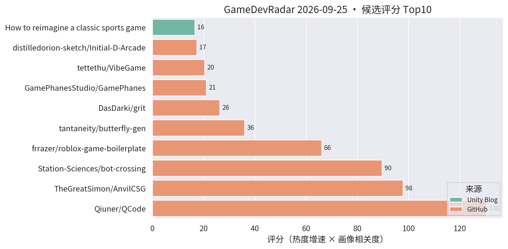
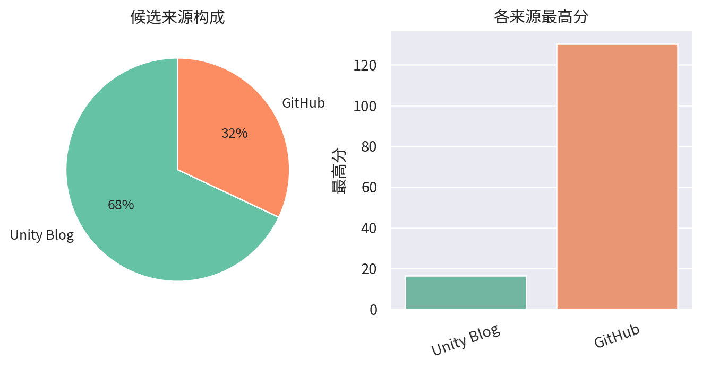

# 游戏开发技术雷达 · 2026-09-25（LLM 点评版）

> 注：今日 GitHub 网络不可达，pull/push 暂不可用，榜单已本地生成，网络恢复后补推。

**今日看点**
1. 新面孔 frrazer/roblox-game-boilerplate：专为 AI agent 设计的 Roblox 游戏脚手架（Rojo + Wally + 类型化）——"AI 友好的工程模板"开始成为独立品类。
2. grit（GDScript 编译器）次日 35★ 稳涨；tantaneity 的 butterfly-gen 评分升至 36，URP 程序化生物系列持续有关注。
3. 三强格局微调：QCode 326★、bot-crossing 687★、AnvilCSG 163★ 增速放缓，榜单进入平稳期。

| # | 评分 | 项目 / 话题 | 来源 | 信号 | 简介 | 点评 |
|---|---|---|---|---|---|---|
| 1 | 130.4 | [Qiuner/QCode](https://github.com/Qiuner/QCode) | github | 326★ / 10天 | An explorable island world to learn AI coding and build real projects with AI agents. Powered by DeepSeek Harness. | 游戏化岛屿世界学 AI 编码；十天 326★，趋势级关注它的玩法化教学设计。 |
| 2 | 97.8 | [TheGreatSimon/AnvilCSG](https://github.com/TheGreatSimon/AnvilCSG) | github | 163★ / 10天 | Anvil CSG Beta 2: a free legacy preview of brush-based level design inside Unity. Hammer-inspired workflow, Built-in and URP. | Hammer 式笔刷关卡设计工具；Unity 关卡白盒刚需，做关卡/TA 的强烈建议试。 |
| 3 | 89.61 | [Station-Sciences/bot-crossing](https://github.com/Station-Sciences/bot-crossing) | github | 687★ / 23天 | A video game for AI agents. Created by Jarren Rocks. | 给 AI agent 玩的游戏，23 天 687★ 逼近 700；做 AI 工作流/游戏 AI 的值得看它的 agent 交互协议设计。 |
| 4 | 66.0 | [frrazer/roblox-game-boilerplate](https://github.com/frrazer/roblox-game-boilerplate) | github | 22★ / 1天 | Roblox game boilerplate for AI agents: Rojo, Wally, typed Packages. | 专为 AI agent 打造的 Roblox 工程脚手架（Rojo/Wally/类型化）；"AI 友好模板"成独立品类，做游戏 AI 基建的值得看它的结构约定。 |
| 5 | 36.0 | [tantaneity/butterfly-gen](https://github.com/tantaneity/butterfly-gen) | github | 4★ / 1天 | Procedural butterflies in Unity: polar wings, groundplan patterns. | URP 程序化蝴蝶生成（极坐标翅形+花纹）；该作者的程序化生物小品系列技术密度稳定，做程序化特效的值得翻。 |
| 6 | 26.25 | [DasDarki/grit](https://github.com/DasDarki/grit) | github | 35★ / 2天 | GDScript Compiler for Godot. | GDScript 编译器，次日稳涨；若能把脚本编译到原生将明显改善 Godot 性能短板，趋势级关注其实现路线。 |
| 7 | 20.96 | [GamePhanesStudio/GamePhanes](https://github.com/GamePhanesStudio/GamePhanes) | github | 475★ / 34天 | An open-source game coding agent environment and benchmark for Godot. | "AI 做游戏"的开源评测环境（Godot 向）；作为 AI 编码能力标尺保持趋势级关注。 |
| 8 | 20.33 | [tettethu/VibeGame](https://github.com/tettethu/VibeGame) | github | 250★ / 43天 | VibeGame: Vibe Your Dream Game -- self-evolving multi-agent framework with an AI-Native game engine. | 自然语言生成 2D 网页游戏的多智能体框架；热度延续，看趋势即可。 |
| 9 | 16.5 | [Backyard Baseball 3D 关卡与 VFX 复盘](https://unity.com/blog/reimagining-backyard-baseball-3d-level-design-and-environment-art) | Unity Blog | 官方发布 | Mega Cat Studios 用可读性关卡设计、decal、灯光和 VFX 把 Backyard Baseball 2026 做成 3D。 | 官方案例：decal + 灯光的可读性关卡设计，对移动端场景表现力有参考价值。 |
| 10 | 15.0 | [Content directories：超越 AssetBundle](https://unity.com/blog/content-directories-beyond-the-assetbundle) | Unity Blog | 官方发布 | Unity 6.6 引入 content directories，更快更细粒度的 AssetBundle 替代方案，支持远程分发。 | 资源系统换代 + 远程分发内置，做热更/资源管理的一线开发者必看，直接影响商业手游更新架构。 |
| 11 | 15.0 | [Deep Rock Galactic: Survivor 手游优化复盘](https://unity.com/blog/optimizing-deep-rock-galactic-survivor-for-mobile) | Unity Blog | 官方发布 | Piktiv 如何把 Deep Rock Galactic: Survivor 移植到移动端。 | 幸存者 like 爆款的手游移植优化复盘，海量同屏单位的性能处理对商业手游直接对口，值得细读。 |
| 12 | 15.0 | [Unity 官方 Codex 插件](https://unity.com/blog/unity-plugin-codex) | Unity Blog | 官方发布 | Unity's official plugin for Codex. | 官方 Codex 插件官宣，官方 AI 编码助手全家桶成型；做 AI 工作流的必看。 |
| 13 | 15.0 | [Sente 六人策略的数据驱动棋盘](https://unity.com/blog/data-driven-board-six-player-strategy-sente) | Unity Blog | 官方发布 | Oxobox 用 Timeline + 数据驱动棋盘做六人同时回合制策略游戏。 | 数据驱动棋盘 + Timeline 表现层，做战棋/卡牌的架构可参考。 |
| 14 | 15.0 | [Causa: Into the Dusk 的 Unity 6.3 移动端移植](https://unity.com/blog/adapting-causa-into-the-dusk-for-mobile) | Unity Blog | 官方发布 | Niebla Games 把 2021 年的 PC 游戏搬上 Google Play Pass 的实战视频。 | 少见的 PC→手游移植实战分享，做移植或多平台适配的值得看。 |

---
*由 GameDevRadar 生成 · 点评由 LLM 按 profile.json 画像撰写 · 原始榜单见 daily.md*
