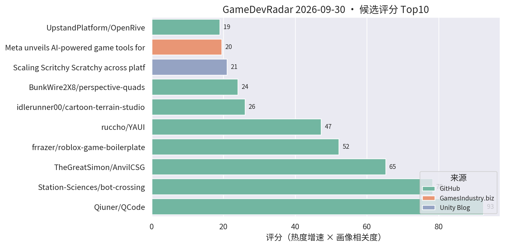
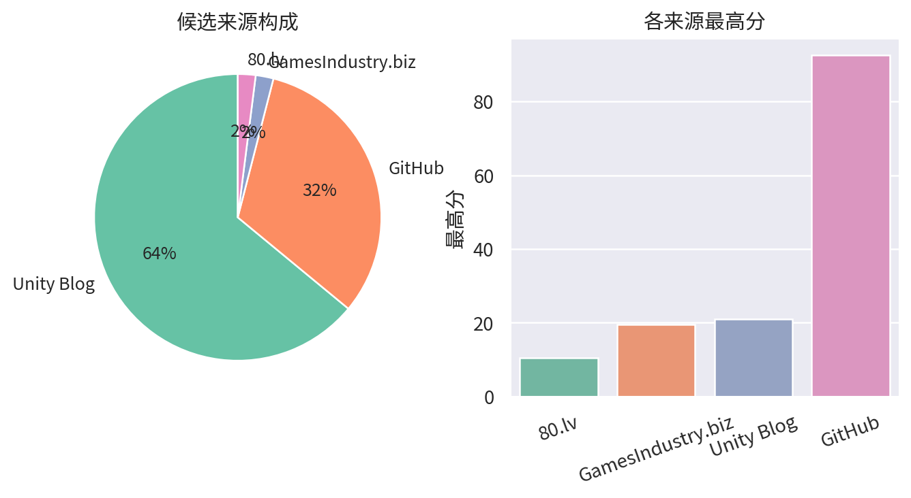

# 游戏开发技术雷达 · 2026-09-30（LLM 点评版）

**今日看点**
1. YAUI 四天 63★（昨日 48★）持续加速——GameObject 上的 Flexbox 式 Unity UI 系统是本周 UI 方向最强新面孔，做卡牌/UI 的别错过。
2. bot-crossing 731★ 继续创新高；roblox-game-boilerplate 87★ 稳居第四，"AI 友好工程模板"品类持续被验证。
3. OpenRive（开源 Rive 替代，编辑器 + AI agent CLI）连续在榜；Meta AI 游戏工具新闻第五天在榜，行业信号持续发酵。

| # | 评分 | 项目 / 话题 | 来源 | 信号 | 简介 | 点评 |
|---|---|---|---|---|---|---|
| 1 | 92.52 | [Qiuner/QCode](https://github.com/Qiuner/QCode) | github | 347★ / 15天 | An explorable island world to learn AI coding and build real projects with AI agents. Powered by DeepSeek Harness. | 游戏化岛屿世界学 AI 编码；15 天 347★ 进入平台期，趋势级关注。 |
| 2 | 78.33 | [Station-Sciences/bot-crossing](https://github.com/Station-Sciences/bot-crossing) | github | 731★ / 28天 | A video game for AI agents. Created by Jarren Rocks. | 给 AI agent 玩的游戏，28 天 731★；做 AI 工作流/游戏 AI 的值得看它的 agent 交互协议设计。 |
| 3 | 65.22 | [TheGreatSimon/AnvilCSG](https://github.com/TheGreatSimon/AnvilCSG) | github | 163★ / 15天 | Anvil CSG Beta 2: a free legacy preview of brush-based level design inside Unity. Hammer-inspired workflow, Built-in and URP. | Hammer 式笔刷关卡设计工具；Unity 关卡白盒刚需，做关卡/TA 的强烈建议试。 |
| 4 | 52.2 | [frrazer/roblox-game-boilerplate](https://github.com/frrazer/roblox-game-boilerplate) | github | 87★ / 5天 | Roblox game boilerplate for AI agents: Rojo, Wally, typed Packages. | 专为 AI agent 打造的 Roblox 工程脚手架；"AI 友好模板"品类代表，做游戏 AI 基建的值得看它的结构约定。 |
| 5 | 47.25 | [ruccho/YAUI](https://github.com/ruccho/YAUI) | github | 63★ / 4天 | Yet Another Unity UI: a fast, Flexbox-based UI system on GameObjects. | 直接在 GameObject 上做 Flexbox 布局的高性能 UI 系统，四天 63★ 加速中；做卡牌/复杂 UI 的重点关注。 |
| 6 | 21.0 | [Scritchy Scratchy 跨平台移植复盘](https://unity.com/blog/scaling-scritchy-scratchy-across-platforms) | Unity Blog | 官方发布 | Learn how Scritchy Scratchy used Unity to port the game across platforms. | 官方跨平台移植案例，多平台适配的实战参考。 |
| 7 | 19.5 | [Meta 发布移动端/浏览器 AI 游戏工具，新 VR 眼镜首日支持 Unity](https://www.gamesindustry.biz/meta-unveils-ai-powered-game-tools-for-mobile-devices-and-browsers-announces-vr-glasses-with-day-one-unity-support) | GamesIndustry.biz | 官方发布 | Meta has revealed two AI-powered game tools that let players... | 行业重磅：Meta 大厂入场 AI 游戏工具；新硬件首日支持 Unity，引擎生态位巩固。 |
| 8 | 19.0 | [UpstandPlatform/OpenRive](https://github.com/UpstandPlatform/OpenRive) | github | 14★ / 7天 | Build interactive UIs, motion, and game experiences in the OpenRive Editor, or let an AI agent generate them through the CLI, running natively across platforms. | 开源 Rive 替代：UI/动效编辑器 + AI agent CLI 生成，全平台原生运行；做 UI 动效/卡牌表现的可关注其成熟度。 |
| 9 | 18.27 | [GamePhanesStudio/GamePhanes](https://github.com/GamePhanesStudio/GamePhanes) | github | 475★ / 39天 | An open-source game coding agent environment and benchmark for Godot. | "AI 做游戏"的开源评测环境（Godot 向）；作为 AI 编码能力标尺保持趋势级关注。 |
| 10 | 16.62 | [codebase/amiga-game-kit](https://github.com/codebase/amiga-game-kit) | github | 19★ / 4天 | Build real Commodore Amiga games with AI agents: C toolchain, headless emulator tests, and art, sound and video pipelines. | 让 AI agent 开发真 Amiga 游戏的全套工具链；retro 向但"AI 友好开发套件"的完整性值得参考。 |
| 11 | 16.5 | [Backyard Baseball 3D 关卡与 VFX 复盘](https://unity.com/blog/reimagining-backyard-baseball-3d-level-design-and-environment-art) | Unity Blog | 官方发布 | Mega Cat Studios 用可读性关卡设计、decal、灯光和 VFX 把 Backyard Baseball 2026 做成 3D。 | 官方案例：decal + 灯光的可读性关卡设计，对移动端场景表现力有参考价值。 |
| 12 | 15.0 | [Content directories：超越 AssetBundle](https://unity.com/blog/content-directories-beyond-the-assetbundle) | Unity Blog | 官方发布 | Unity 6.6 引入 content directories，更快更细粒度的 AssetBundle 替代方案，支持远程分发。 | 资源系统换代 + 远程分发内置，做热更/资源管理的一线开发者必看。 |
| 13 | 15.0 | [Deep Rock Galactic: Survivor 手游优化复盘](https://unity.com/blog/optimizing-deep-rock-galactic-survivor-for-mobile) | Unity Blog | 官方发布 | Piktiv 如何把 Deep Rock Galactic: Survivor 移植到移动端。 | 幸存者 like 爆款的手游移植优化复盘，海量同屏单位的性能处理对商业手游直接对口。 |
| 14 | 15.0 | [Unity 官方 Codex 插件](https://unity.com/blog/unity-plugin-codex) | Unity Blog | 官方发布 | Unity's official plugin for Codex. | 官方 Codex 插件官宣，官方 AI 编码助手全家桶成型；做 AI 工作流的必看。 |
| 15 | 15.0 | [Sente 六人策略的数据驱动棋盘](https://unity.com/blog/data-driven-board-six-player-strategy-sente) | Unity Blog | 官方发布 | Oxobox 用 Timeline + 数据驱动棋盘做六人同时回合制策略游戏。 | 数据驱动棋盘 + Timeline 表现层，做战棋/卡牌的架构可参考。 |

---
*由 GameDevRadar 生成 · 点评由 LLM 按 profile.json 画像撰写 · 原始榜单见 daily.md*
