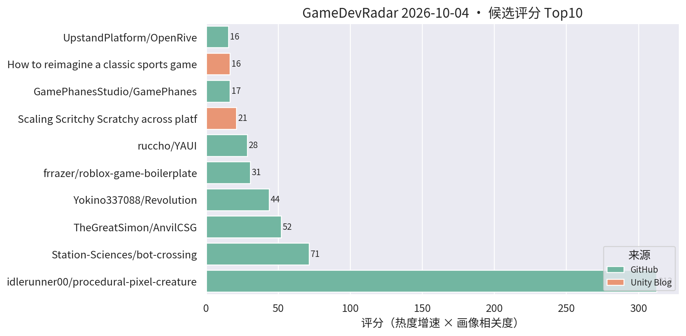
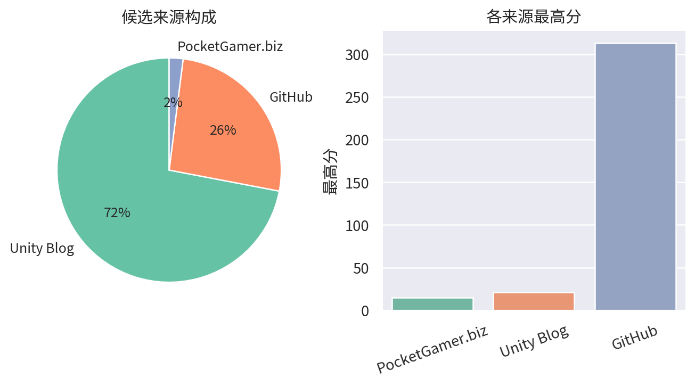

# 游戏开发技术雷达 · 2026-10-04（LLM 点评版）

**今日看点**
1. Yokino337088/Revolution 连涨：90★→102★、连续两天高分上榜，自称"革命性 Unity 客户端框架"但描述信息量仍极低——值得 5 分钟验货，重点看它解决热更、网络还是架构问题。
2. 被剔除的旁观察：Godot 的 procedural-pixel-creatures 连续两日全场最高评分（312.75，139★/2天）——Godot 生态的程序化像素生成工具热度持续，趋势级记录。
3. OpenRive 回升上榜：开源 Rive 替代品，支持 AI agent 通过 CLI 直接生成动画 UI——游戏 UI 动效管线 + AI 工作流的双重信号。

| # | 评分 | 项目 / 话题 | 来源 | 信号 | 简介 | 点评 |
|---|---|---|---|---|---|---|
| 1 | 71.43 | [Station-Sciences/bot-crossing](https://github.com/Station-Sciences/bot-crossing) | github | 762★ / 32天 | A video game for AI agents. Created by Jarren Rocks | "AI agent 玩的游戏"这个新品类的样本，满月仍 750+★；做 AI 玩法/AI 游戏的值得看它怎么把 agent 当玩家设计。 |
| 2 | 52.08 | [TheGreatSimon/AnvilCSG](https://github.com/TheGreatSimon/AnvilCSG) | github | 165★ / 19天 | Anvil CSG Beta 2: a free legacy preview of brush-based level design inside Unity. Hammer-inspired workflow, Built-in and URP. | Hammer 式笔刷关卡设计工具，Built-in/URP 双支持；Unity 关卡白盒刚需，做关卡/TA 的强烈建议试。 |
| 3 | 43.71 | [Yokino337088/Revolution](https://github.com/Yokino337088/Revolution) | github | 102★ / 7天 | Revolution——具有革命性的Unity客户端框架。 | 自称革命性的 Unity 客户端框架，一周 102★ 但 README 信息量极低；可花 5 分钟验货，注意甄别宣传水分。 |
| 4 | 30.66 | [frrazer/roblox-game-boilerplate](https://github.com/frrazer/roblox-game-boilerplate) | github | 92★ / 9天 | Roblox game boilerplate for AI agents: Rojo, Wally, typed Packet networking, ProfileStore data, strict Luau and an AGENTS.md | 专为 AI agent 协作设计的 Roblox 工程模板（自带 AGENTS.md）；"AI 友好型工程结构"的参考样本，对 Unity 项目的 AI 协作改造有借鉴意义。 |
| 5 | 28.5 | [ruccho/YAUI](https://github.com/ruccho/YAUI) | github | 76★ / 8天 | Yet Another Unity UI: a fast, Flexbox-based UI system on GameObjects. | 直接在 GameObject 上做 Flexbox 布局的高性能 UI 系统；做卡牌/复杂 UI 的重点关注，手游 UI 适配友好。 |
| 6 | 21.0 | [Scaling Scritchy Scratchy across platforms](https://unity.com/blog/scaling-scritchy-scratchy-across-platforms) | Unity Blog | 官方发布 | Learn how Scritchy Scratchy used Unity to port the game across platforms. | 官方跨平台移植案例，多平台适配的实战参考。 |
| 7 | 16.58 | [GamePhanesStudio/GamePhanes](https://github.com/GamePhanesStudio/GamePhanes) | github | 475★ / 43天 | An open-source game coding agent environment and benchmark for Godot. | "AI 做游戏"的开源评测环境（Godot 向）；作为 AI 编码能力标尺保持趋势级关注。 |
| 8 | 16.5 | [Backyard Baseball 3D 关卡与 VFX 复盘](https://unity.com/blog/reimagining-backyard-baseball-3d-level-design-and-environment-art) | Unity Blog | 官方发布 | Mega Cat Studios 用可读性关卡设计、decal、灯光和 VFX 把 Backyard Baseball 2026 做成 3D。 | 官方案例：decal + 灯光的可读性关卡设计，对移动端场景表现力有参考价值。 |
| 9 | 15.58 | [UpstandPlatform/OpenRive](https://github.com/UpstandPlatform/OpenRive) | github | 18★ / 11天 | Build interactive UIs, motion, and game experiences in the OpenRive Editor, or let an AI agent generate them through the CLI. | 开源 Rive 替代品，亮点是 AI agent 可用 CLI 直接生成动画 UI；游戏 UI 动效管线 + AI 工作流方向值得跟踪。 |
| 10 | 15.0 | [Content directories：超越 AssetBundle](https://unity.com/blog/content-directories-beyond-the-assetbundle) | Unity Blog | 官方发布 | Unity 6.6 引入 content directories，更快更细粒度的 AssetBundle 替代方案，支持远程分发。 | 资源系统换代 + 远程分发内置，做热更/资源管理的一线开发者必看。 |
| 11 | 15.0 | [Deep Rock Galactic: Survivor 手游优化复盘](https://unity.com/blog/optimizing-deep-rock-galactic-survivor-for-mobile) | Unity Blog | 官方发布 | Piktiv 如何把 Deep Rock Galactic: Survivor 移植到移动端。 | 幸存者 like 爆款的手游移植优化复盘，海量同屏单位的性能处理对商业手游直接对口。 |
| 12 | 15.0 | [Unity 官方 Codex 插件](https://unity.com/blog/unity-plugin-codex) | Unity Blog | 官方发布 | Unity's official plugin for Codex. | 官方 Codex 插件官宣，Unity 官方 AI 编码助手成型；做 AI 工作流的必看。 |
| 13 | 15.0 | [Sente 六人策略的数据驱动棋盘](https://unity.com/blog/data-driven-board-six-player-strategy-sente) | Unity Blog | 官方发布 | Oxobox 用 Timeline + 数据驱动棋盘做六人同时回合制策略游戏。 | 数据驱动棋盘 + Timeline 表现层，做战棋/卡牌的架构可参考。 |
| 14 | 15.0 | [Causa: Into the Dusk 的 Unity 6.3 移动端移植](https://unity.com/blog/adapting-causa-into-the-dusk-for-mobile) | Unity Blog | 官方发布 | Niebla Games 把 2021 年的 PC 游戏搬上 Google Play Pass 的实战视频。 | 少见的 PC→手游移植实战分享，做移植或多平台适配的值得看。 |
| 15 | 15.0 | [PocketGamer 一周观点：AppLovin vs Unity、Supercell 未遂交易、Mario Kart Tour 停运](https://www.pocketgamer.biz/mobile-tracker-claims-the-supercell-deal-that-never-happened-mario-kart-tours-closure-and-applovin-vs-unity-week-in-views/) | PocketGamer.biz | 官方发布 | 手游行业一周争议与大事汇总。 | 行业侧重磅汇总：AppLovin 与 Unity 的争端直接关系买量变现生态，做商业化的值得读。 |

---
*由 GameDevRadar 生成 · 点评由 LLM 按 profile.json 画像撰写 · 原始榜单见 daily.md*
