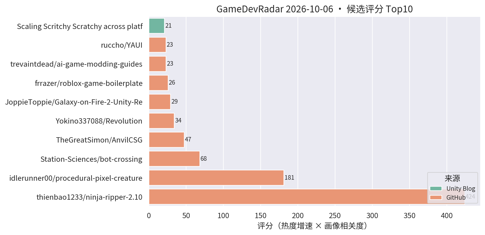
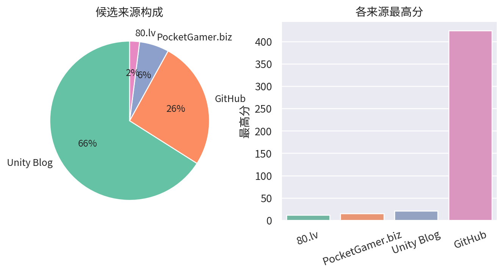

# 游戏开发技术雷达 · 2026-10-06（LLM 点评版）

**今日看点**
1. 榜首是个坑：ninja-ripper-2.10 首日 106★、评分 424 全场最高，但实为付费工具 Ninja Ripper 的"免费测试版"镜像搬运仓，topics 堆砌关键词——灰色下载站性质已剔除，提醒别被星数骗。
2. ai-game-modding-guides 次日续涨（30★→46★）：用 AI 编码 agent 做游戏 mod 的指南集热度在发酵——AI 工作流方向连续两天出新信号。
3. 被剔除的旁观察：Godot 的 procedural-pixel-creatures 四连冠（161★/4天，评分 181.12）——Godot 程序化生成工具持续霸榜，趋势级记录继续。

| # | 评分 | 项目 / 话题 | 来源 | 信号 | 简介 | 点评 |
|---|---|---|---|---|---|---|
| 1 | 68.28 | [Station-Sciences/bot-crossing](https://github.com/Station-Sciences/bot-crossing) | github | 774★ / 34天 | A video game for AI agents. Created by Jarren Rocks | "AI agent 玩的游戏"品类样本，774★ 热度稳定；做 AI 玩法/AI 游戏的值得看它怎么把 agent 当玩家设计。 |
| 2 | 47.4 | [TheGreatSimon/AnvilCSG](https://github.com/TheGreatSimon/AnvilCSG) | github | 166★ / 21天 | Anvil CSG Beta 2: a free legacy preview of brush-based level design inside Unity. Hammer-inspired workflow, Built-in and URP. | Hammer 式笔刷关卡设计工具，Built-in/URP 双支持；Unity 关卡白盒刚需，做关卡/TA 的强烈建议试。 |
| 3 | 33.99 | [Yokino337088/Revolution](https://github.com/Yokino337088/Revolution) | github | 102★ / 9天 | Revolution——具有革命性的Unity客户端框架。 | 自称革命性的 Unity 客户端框架，涨星已连续三日停滞在 102★，README 仍无实质内容；宣传水分嫌疑大，可跳过。 |
| 4 | 29.01 | [frrazer/roblox-game-boilerplate](https://github.com/frrazer/roblox-game-boilerplate) | github | 94★ / 11天 | Roblox game boilerplate for AI agents: Rojo, Wally, typed Packet networking, ProfileStore data, strict Luau and an AGENTS.md | 专为 AI agent 协作设计的 Roblox 工程模板（自带 AGENTS.md）；"AI 友好型工程结构"参考样本，对 Unity 项目的 AI 协作改造有借鉴意义。 |
| 5 | 23.0 | [trevaintdead/ai-game-modding-guides](https://github.com/trevaintdead/ai-game-modding-guides) | github | 46★ / 2天 | Guides for building game mods with AI coding agents: passthrough mods, Rust rewrites, mod loaders, prompting, and troubleshooting. | 用 AI 编码 agent 做游戏 mod 的实战指南集，含 prompting 与排错，两日 46★ 增速不错；做 AI 工作流/工具链的值得翻，纯文档仓无代码框架。 |
| 6 | 22.8 | [ruccho/YAUI](https://github.com/ruccho/YAUI) | github | 76★ / 10天 | Yet Another Unity UI: a fast, Flexbox-based UI system on GameObjects. | 直接在 GameObject 上做 Flexbox 布局的高性能 UI 系统；做卡牌/复杂 UI 的重点关注，手游 UI 适配友好。 |
| 7 | 21.0 | [Scaling Scritchy Scratchy across platforms](https://unity.com/blog/scaling-scritchy-scratchy-across-platforms) | Unity Blog | 官方发布 | Learn how Scritchy Scratchy used Unity to port the game across platforms. | 官方跨平台移植案例，多平台适配的实战参考。 |
| 8 | 16.5 | [Backyard Baseball 3D 关卡与 VFX 复盘](https://unity.com/blog/reimagining-backyard-baseball-3d-level-design-and-environment-art) | Unity Blog | 官方发布 | Mega Cat Studios 用可读性关卡设计、decal、灯光和 VFX 把 Backyard Baseball 2026 做成 3D。 | 官方案例：decal + 灯光的可读性关卡设计，对移动端场景表现力有参考价值。 |
| 9 | 15.39 | [UpstandPlatform/OpenRive](https://github.com/UpstandPlatform/OpenRive) | github | 21★ / 13天 | Build interactive UIs, motion, and game experiences in the OpenRive Editor, or let an AI agent generate them through the CLI. | 开源 Rive 替代品，亮点是 AI agent 可用 CLI 直接生成动画 UI；游戏 UI 动效管线 + AI 工作流方向值得跟踪。 |
| 10 | 15.0 | [Content directories：超越 AssetBundle](https://unity.com/blog/content-directories-beyond-the-assetbundle) | Unity Blog | 官方发布 | Unity 6.6 引入 content directories，更快更细粒度的 AssetBundle 替代方案，支持远程分发。 | 资源系统换代 + 远程分发内置，做热更/资源管理的一线开发者必看。 |
| 11 | 15.0 | [Deep Rock Galactic: Survivor 手游优化复盘](https://unity.com/blog/optimizing-deep-rock-galactic-survivor-for-mobile) | Unity Blog | 官方发布 | Piktiv 如何把 Deep Rock Galactic: Survivor 移植到移动端。 | 幸存者 like 爆款的手游移植优化复盘，海量同屏单位的性能处理对商业手游直接对口。 |
| 12 | 15.0 | [Unity 官方 Codex 插件](https://unity.com/blog/unity-plugin-codex) | Unity Blog | 官方发布 | Unity's official plugin for Codex. | 官方 Codex 插件官宣，Unity 官方 AI 编码助手成型；做 AI 工作流的必看。 |
| 13 | 15.0 | [Sente 六人策略的数据驱动棋盘](https://unity.com/blog/data-driven-board-six-player-strategy-sente) | Unity Blog | 官方发布 | Oxobox 用 Timeline + 数据驱动棋盘做六人同时回合制策略游戏。 | 数据驱动棋盘 + Timeline 表现层，做战棋/卡牌的架构可参考。 |

---
*由 GameDevRadar 生成 · 点评由 LLM 按 profile.json 画像撰写 · 原始榜单见 daily.md*
