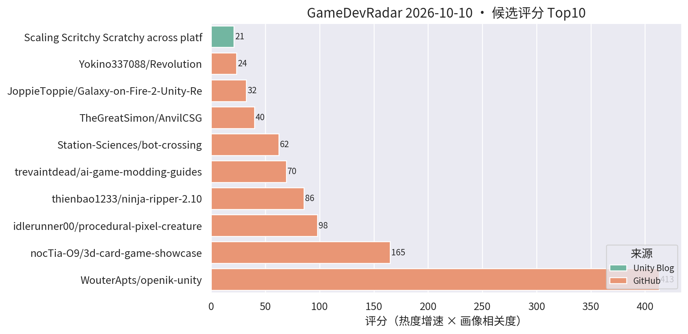
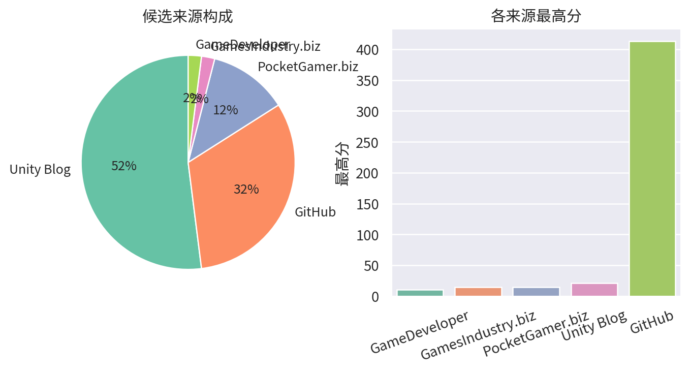

# 游戏开发技术雷达 · 2026-10-10（LLM 点评版）

**今日看点**
1. 双新面孔登顶：openik-unity（Unity IK 包，CCD/FABRIK 多求解器 + 关节限制 + 程序化动画示例，首日 59★ 拿下 413 分）——真工具，做动画/TA 的直接对口。
2. 另一新面孔 3d-card-game-showcase：Unity 3D 卡牌 Demo（回合战斗 + 地图生成 + UI Toolkit，55★/2天）——作品集性质，但卡牌 + UI Toolkit 组合对做卡牌 UI 的有参考。
3. Revolution 连续七日 102★ 零增长——彻底凉透，维持"宣传水分坐实"结论，后续再上榜将考虑直接移出。

| # | 评分 | 项目 / 话题 | 来源 | 信号 | 简介 | 点评 |
|---|---|---|---|---|---|---|
| 1 | 413.0 | [WouterApts/openik-unity](https://github.com/WouterApts/openik-unity) | github | 59★ / 1天 | Inverse Kinematics package for Unity, featuring multiple solvers, joint limits and procedural animation samples. | Unity IK 包：CCD/FABRIK 多求解器 + 关节限制 + 程序化动画示例，首日 59★；做动画/TA/程序化动作的值得立刻试，真工具无水分。 |
| 2 | 165.0 | [nocTia-O9/3d-card-game-showcase](https://github.com/nocTia-O9/3d-card-game-showcase) | github | 55★ / 2天 | Unity / C# 3D 卡牌游戏：核心脚本、回合战斗、地图生成与 UI Toolkit | 个人作品集性质的 3D 卡牌 Demo（回合战斗 + 地图生成 + UI Toolkit），非框架工具；做卡牌 UI 的可扫一眼 UI Toolkit 用法，别期待工程深度。 |
| 3 | 69.5 | [trevaintdead/ai-game-modding-guides](https://github.com/trevaintdead/ai-game-modding-guides) | github | 417★ / 6天 | Guides for building game mods with AI coding agents: passthrough mods, Rust rewrites, mod loaders, prompting, and troubleshooting. | 用 AI 编码 agent 做游戏 mod 的实战指南集，六日 417★ 持续爆发；做 AI 工作流的值得认真翻，纯文档仓。 |
| 4 | 62.37 | [Station-Sciences/bot-crossing](https://github.com/Station-Sciences/bot-crossing) | github | 790★ / 38天 | A video game for AI agents. Created by Jarren Rocks | "AI agent 玩的游戏"品类样本，790★ 热度稳定；做 AI 玩法/AI 游戏的值得看它怎么把 agent 当玩家设计。 |
| 5 | 39.84 | [TheGreatSimon/AnvilCSG](https://github.com/TheGreatSimon/AnvilCSG) | github | 166★ / 25天 | Anvil CSG Beta 2: a free legacy preview of brush-based level design inside Unity. Hammer-inspired workflow, Built-in and URP. | Hammer 式笔刷关卡设计工具，Built-in/URP 双支持；Unity 关卡白盒刚需，做关卡/TA 的强烈建议试。 |
| 6 | 23.55 | [Yokino337088/Revolution](https://github.com/Yokino337088/Revolution) | github | 102★ / 13天 | Revolution——具有革命性的Unity客户端框架。 | 自称革命性的 Unity 客户端框架，连续七日零增长且无实质文档；宣传水分坐实，不建议花时间。 |
| 7 | 21.0 | [Scaling Scritchy Scratchy across platforms](https://unity.com/blog/scaling-scritchy-scratchy-across-platforms) | Unity Blog | 官方发布 | Learn how Scritchy Scratchy used Unity to port the game across platforms. | 官方跨平台移植案例，多平台适配的实战参考。 |
| 8 | 20.19 | [frrazer/roblox-game-boilerplate](https://github.com/frrazer/roblox-game-boilerplate) | github | 101★ / 15天 | Roblox game boilerplate for AI agents: Rojo, Wally, typed Packet networking, ProfileStore data, strict Luau and an AGENTS.md | 专为 AI agent 协作设计的 Roblox 工程模板（自带 AGENTS.md）；"AI 友好型工程结构"参考样本，对 Unity 项目的 AI 协作改造有借鉴意义。 |
| 9 | 17.37 | [ruccho/YAUI](https://github.com/ruccho/YAUI) | github | 81★ / 14天 | Yet Another Unity UI: a fast, Flexbox-based UI system on GameObjects. | 直接在 GameObject 上做 Flexbox 布局的高性能 UI 系统；做卡牌/复杂 UI 的重点关注，手游 UI 适配友好。 |
| 10 | 16.5 | [Echo Weaver：Unity 6 时间循环 metroidbrainia](https://unity.com/blog/echo-weaver-time-loop-unity) | Unity Blog | 官方发布 | Moonlight Kids 讲解如何用 Unity 6 构建时间循环玩法。 | 官方案例：时间循环 + 银河城式地图状态管理，做关卡/系统设计的值得看拆解。 |
| 11 | 16.5 | [Backyard Baseball 3D 关卡与 VFX 复盘](https://unity.com/blog/reimagining-backyard-baseball-3d-level-design-and-environment-art) | Unity Blog | 官方发布 | Mega Cat Studios 用可读性关卡设计、decal、灯光和 VFX 把 Backyard Baseball 2026 做成 3D。 | 官方案例：decal + 灯光的可读性关卡设计，对移动端场景表现力有参考价值。 |
| 12 | 15.11 | [UpstandPlatform/OpenRive](https://github.com/UpstandPlatform/OpenRive) | github | 27★ / 17天 | Build interactive UIs, motion, and game experiences in the OpenRive Editor, or let an AI agent generate them through the CLI. | 开源 Rive 替代品，亮点是 AI agent 可用 CLI 直接生成动画 UI；游戏 UI 动效管线 + AI 工作流方向值得跟踪。 |
| 13 | 15.0 | [Content directories：超越 AssetBundle](https://unity.com/blog/content-directories-beyond-the-assetbundle) | Unity Blog | 官方发布 | Unity 6.6 引入 content directories，更快更细粒度的 AssetBundle 替代方案，支持远程分发。 | 资源系统换代 + 远程分发内置，做热更/资源管理的一线开发者必看。 |
| 14 | 15.0 | [Deep Rock Galactic: Survivor 手游优化复盘](https://unity.com/blog/optimizing-deep-rock-galactic-survivor-for-mobile) | Unity Blog | 官方发布 | Piktiv 如何把 Deep Rock Galactic: Survivor 移植到移动端。 | 幸存者 like 爆款的手游移植优化复盘，海量同屏单位的性能处理对商业手游直接对口。 |
| 15 | 15.0 | [Unity 官方 Codex 插件](https://unity.com/blog/unity-plugin-codex) | Unity Blog | 官方发布 | Unity's official plugin for Codex. | 官方 Codex 插件官宣，Unity 官方 AI 编码助手成型；做 AI 工作流的必看。 |

---
*由 GameDevRadar 生成 · 点评由 LLM 按 profile.json 画像撰写 · 原始榜单见 daily.md*
